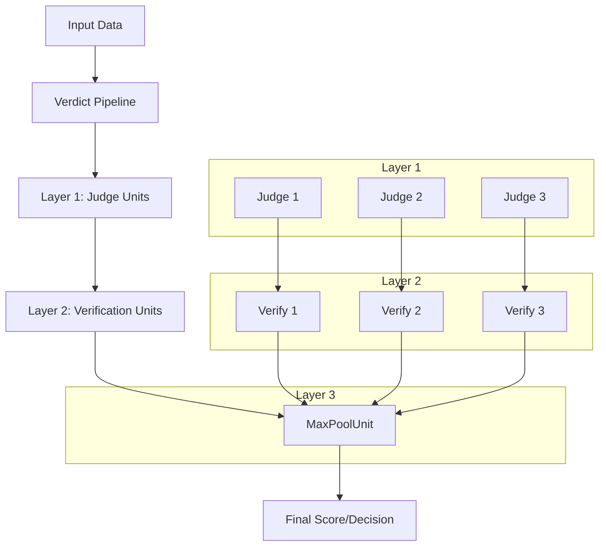
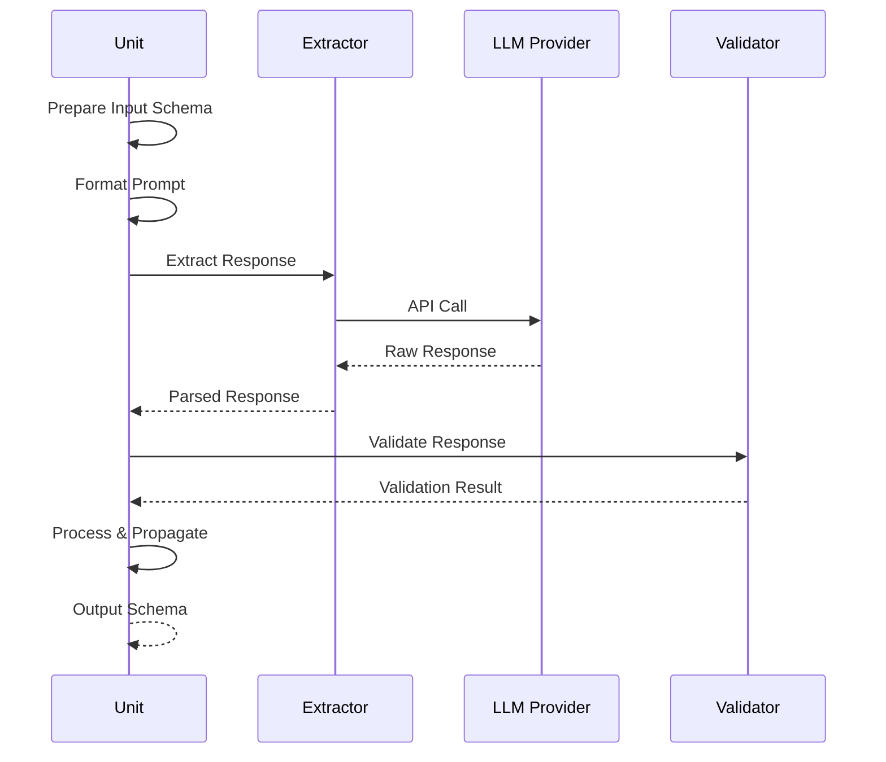
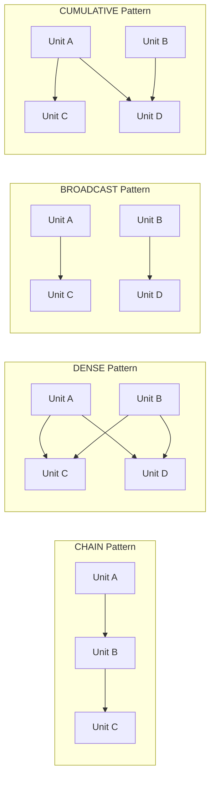

# Verdict Integration Plan for Promptfoo

## Overview

This document outlines the plan to integrate [Verdict](https://github.com/haizelabs/verdict) as a model-graded metric in Promptfoo. Verdict is a declarative framework for building compound LLM-as-a-judge systems that scales up "judge-time compute" to create more reliable evaluations.

## What is Verdict?

Verdict addresses the unreliability of simple LLM judges by composing multiple rounds of reasoning, verification, and aggregation. Instead of a single LLM call, Verdict synthesizes multiple units of evaluation to produce more robust judgments.

### Key Concepts

1. **Unit** - The base building block that executes a single evaluation step
2. **Layer** - A container for multiple units that can be connected in various patterns
3. **Block** - A higher-level container that composes units and layers into complex graphs
4. **Scales** - Typed response schemas (e.g., DiscreteScale, LikertScale, BooleanScale)

## Architecture Overview

### High-Level Architecture



### Unit Execution Flow



### Connection Patterns



## How Verdict Works

### 1. Basic Judge Unit

```python
JudgeUnit(DiscreteScale((1, 5)))
    .prompt("Evaluate the politeness...")
    .via('gpt-4o-mini', retries=3, temperature=0.4)
```

### 2. Hierarchical Verification

```python
Pipeline() \
    >> JudgeUnit(explanation=True)     # Initial judgment with explanation
    >> VerifyUnit()                     # Verify the explanation is sound
```

### 3. Ensemble with Voting

```python
Pipeline() \
    >> Layer(
        JudgeUnit() >> VerifyUnit(),   # Create judge-verify pairs
        repeat=3                        # Repeat 3 times
    ) \
    >> MaxPoolUnit()                    # Vote for most common answer
```

## TypeScript Port Strategy

### Key Differences from Python Implementation

1. **Type System**
   - Python uses Pydantic for runtime validation
   - TypeScript will use Zod for schema validation
   - Static typing throughout the codebase

2. **Async/Await Pattern**
   - Python uses async/await with asyncio
   - TypeScript uses native Promises and async/await
   - Concurrent execution using Promise.all()

3. **Configuration**
   - Python uses method chaining for configuration
   - TypeScript will support both object configuration and builder pattern

### Core Types to Implement

```typescript
// Scale types
interface Scale<T> {
  values: T[];
  validate(value: T): boolean;
  serialize(): string;
}

class DiscreteScale implements Scale<string> {
  constructor(public values: string[]) {}
}

class LikertScale implements Scale<number> {
  constructor(
    public min: number,
    public max: number,
  ) {}
}

// Unit types
interface Unit<TInput, TOutput> {
  execute(input: TInput): Promise<TOutput>;
  validate(input: TInput, response: any): void;
  process(input: TInput, response: any): TOutput;
}

// Pipeline types
interface Pipeline {
  units: Unit<any, any>[];
  execute(input: any): Promise<any>;
}
```

## Implementation Strategy

### Phase 1: Core Infrastructure

1. **Create TypeScript Types**
   - Port Scale types (DiscreteScale, BooleanScale, etc.)
   - Define Unit, Layer, and Pipeline interfaces
   - Create execution context types

2. **Implement Base Classes**
   - `VerdictUnit` - Base class for all evaluation units
   - `VerdictLayer` - Container for multiple units
   - `VerdictPipeline` - Main execution orchestrator

### Phase 2: Core Units

1. **Judge Units**
   - `DirectScoreJudgeUnit` - Direct numerical scoring
   - `CategoricalJudgeUnit` - Yes/No or categorical decisions
   - `PairwiseJudgeUnit` - Compare two options

2. **Aggregation Units**
   - `MaxPoolUnit` - Majority voting
   - `MeanPoolUnit` - Average scoring
   - `WeightedPoolUnit` - Weighted aggregation

3. **Verification Units**
   - `VerifyUnit` - Verify explanations are valid
   - `ConsistencyUnit` - Check for consistent reasoning

### Phase 3: Integration with Promptfoo

1. **Create Assertion Handler**

   ```typescript
   // src/assertions/verdict.ts
   export const handleVerdict = async ({
     assertion,
     outputString,
     test,
   }: AssertionParams): Promise<GradingResult>
   ```

2. **Register Assertion Type**
   - Add 'verdict' to BaseAssertionTypesSchema
   - Update assertion handlers map

3. **Configuration Schema**
   ```yaml
   assert:
     - type: verdict
       value:
         pipeline:
           - type: judge
             prompt: 'Evaluate politeness...'
             scale: [1, 5]
           - type: verify
             prompt: 'Check if explanation is valid...'
         repeat: 3
         aggregate: max
   ```

### Phase 4: Advanced Features

1. **Custom Extractors**
   - Support different response formats
   - Handle streaming responses
   - Parse structured outputs

2. **Rate Limiting**
   - Client-side rate limiting
   - Token usage tracking
   - Concurrent execution management

3. **Visualization**
   - Execution graph visualization
   - Debug mode with step-by-step results
   - Token usage reporting

## File Structure

```
src/
├── assertions/
│   └── verdict/
│       ├── index.ts           # Main assertion handler
│       ├── types.ts           # TypeScript types
│       ├── units/             # Unit implementations
│       │   ├── base.ts
│       │   ├── judge.ts
│       │   ├── verify.ts
│       │   └── aggregate.ts
│       ├── scales.ts          # Scale implementations
│       ├── pipeline.ts        # Pipeline executor
│       └── prompts.ts         # Default prompts
```

## Example Usage in Promptfoo

### Basic Examples

```yaml
# Simple categorical judgment
assert:
  - type: verdict
    value:
      type: categorical
      prompt: "Is this response helpful?"
      categories: ["yes", "no"]
    threshold: 0.8

# Likert scale rating
assert:
  - type: verdict
    value:
      type: likert
      prompt: "Rate the quality of this response"
      scale: [1, 5]
      explanation: true
    threshold: 4

# Pairwise comparison
assert:
  - type: verdict
    value:
      type: pairwise
      prompt: "Which response is more accurate?"
      options: ["{{output}}", "{{vars.baseline}}"]
```

### Advanced Examples

```yaml
# Hierarchical verification with majority voting
assert:
  - type: verdict
    value:
      pipeline:
        - layer:
            unit:
              type: categorical-judge
              prompt: "Does this response contain factual errors?"
              categories: ["yes", "no"]
              explanation: true
            repeat: 3
        - layer:
            unit:
              type: verify
              prompt: |
                Check if the explanation correctly identifies factual errors:
                Explanation: {{previous.explanation}}
                Response: {{output}}
        - type: max-pool
      threshold: 0.7

# Multi-criteria evaluation
assert:
  - type: verdict
    value:
      pipeline:
        - layer:
            units:
              - type: likert
                name: accuracy
                prompt: "Rate accuracy (1-5)"
                scale: [1, 5]
              - type: likert
                name: clarity
                prompt: "Rate clarity (1-5)"
                scale: [1, 5]
              - type: likert
                name: completeness
                prompt: "Rate completeness (1-5)"
                scale: [1, 5]
        - type: weighted-mean
          weights:
            accuracy: 0.5
            clarity: 0.3
            completeness: 0.2
      threshold: 4.0

# Debate-style evaluation
assert:
  - type: verdict
    value:
      pipeline:
        - layer:
            units:
              - type: debate-for
                prompt: "Argue why this response is good"
              - type: debate-against
                prompt: "Argue why this response is bad"
            repeat: 2
        - type: judge
          prompt: "Based on the debate, is this a good response?"
          categories: ["yes", "no"]
```

### Integration with Existing Promptfoo Features

```yaml
# Using with providers
assert:
  - type: verdict
    provider: gpt-4o-mini  # Override default provider
    value:
      type: categorical
      prompt: "Is this appropriate?"
      categories: ["yes", "no"]

# Using with variables
assert:
  - type: verdict
    value:
      type: likert
      prompt: |
        Given the requirements: {{vars.requirements}}
        Rate how well this response meets them.
      scale: [1, 10]
    metric: requirement-satisfaction

# Combining with other assertions
assert:
  - type: contains
    value: "{{vars.required_keyword}}"
  - type: verdict
    value:
      type: categorical
      prompt: "Is the tone professional?"
      categories: ["yes", "no"]
  - type: llm-rubric
    value: "Response should be concise"
```

## Benefits of Verdict Integration

1. **More Reliable Evaluations** - Multiple rounds of verification reduce false positives/negatives
2. **Flexible Architecture** - Compose evaluation patterns for different use cases
3. **Scalable** - Handles thousands of concurrent LLM calls efficiently
4. **Research-Backed** - Based on scalable oversight and evaluation research

## Attribution

This implementation is based on the [Verdict library](https://github.com/haizelabs/verdict) by Haize Labs. Key paper:

```bibtex
@article{kalra2025verdict,
  title={VERDICT: A Library for Scaling Judge-Time Compute},
  author={Kalra, Nimit and Tang, Leonard},
  journal={arXiv preprint arXiv:2502.18018},
  year={2025}
}
```

## Timeline

1. **Week 1**: Core infrastructure and basic units
2. **Week 2**: Integration with Promptfoo assertion system
3. **Week 3**: Advanced features and optimization
4. **Week 4**: Documentation, examples, and testing

## Quick Reference: Verdict vs Traditional Assertions

| Feature           | Traditional (llm-rubric, g-eval) | Verdict                |
| ----------------- | -------------------------------- | ---------------------- |
| Single LLM Call   | ✅ Yes                           | ❌ No (multiple calls) |
| Verification      | ❌ No                            | ✅ Yes (built-in)      |
| Ensemble Support  | ❌ No                            | ✅ Yes (native)        |
| Structured Scales | ❌ No                            | ✅ Yes (typed)         |
| Debate/Discussion | ❌ No                            | ✅ Yes                 |
| Token Efficiency  | ✅ More efficient                | ⚠️ Uses more tokens    |
| Reliability       | ⚠️ Variable                      | ✅ Higher              |

## Implementation Priorities

### MVP Features (Phase 1)

1. Basic categorical and likert scale judgments
2. Simple verification pattern
3. Majority voting aggregation
4. YAML configuration support

### Extended Features (Phase 2)

1. Hierarchical verification
2. Debate patterns
3. Custom aggregation functions
4. Streaming support
5. Visualization in UI

### Future Features (Phase 3)

1. DSPy integration
2. Custom unit types via plugins
3. A/B testing framework
4. Real-time monitoring

## Next Steps

1. **Set up development branch**

   ```bash
   git checkout -b feature/verdict-integration
   ```

2. **Create initial file structure**

   ```bash
   mkdir -p src/assertions/verdict/{units,scales}
   touch src/assertions/verdict/{index.ts,types.ts,pipeline.ts}
   ```

3. **Implement core types and base classes**

4. **Add basic unit tests**

5. **Create documentation and examples**

## Open Questions

1. Should we support all verdict features or start with a subset?
   - **Recommendation**: Start with MVP features, expand based on user feedback

2. How to handle visualization in the Promptfoo UI?
   - **Recommendation**: Add execution trace in debug mode, full visualization in Phase 2

3. Should configuration be YAML-based or support programmatic definition?
   - **Recommendation**: YAML for config files, TypeScript API for advanced users

4. How to integrate with existing grading providers?
   - **Recommendation**: Use same provider resolution as llm-rubric/g-eval
