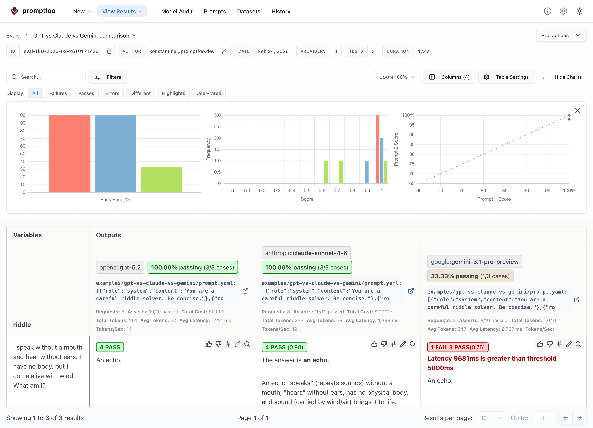

# Promptfoo: 大模型评估与红队测试工具

<p align="center">
  <a href="https://npmjs.com/package/promptfoo"></a>
  <a href="https://npmjs.com/package/promptfoo"></a>
  <a href="https://github.com/promptfoo/promptfoo/actions/workflows/main.yml"></a>
  <a href="https://github.com/promptfoo/promptfoo/blob/main/LICENSE"></a>
  <a href="https://discord.gg/promptfoo"></a>
</p>

<p align="center">
  <code>promptfoo</code> 是一款用于评估和“红队测试（red-teaming）”大模型应用的 CLI 工具及库。告别盲目的试错，开始交付安全、可靠的 AI 应用。
</p>

<p align="center">
  <a href="https://www.promptfoo.dev">官方网站</a> ·
  <a href="https://www.promptfoo.dev/docs/getting-started/">快速开始</a> ·
  <a href="https://www.promptfoo.dev/docs/red-team/">红队测试</a> ·
  <a href="https://www.promptfoo.dev/docs/">完整文档</a> ·
  <a href="https://discord.gg/promptfoo">Discord 社区</a>
</p>

> **动态更新 (2026年3月16日)：** Promptfoo 已正式加入 OpenAI。Promptfoo 将保持开源并遵循 MIT 许可证。阅读 [公司动态](https://www.promptfoo.dev/blog/promptfoo-joining-openai/)。

## 快速开始

```sh
npm install -g promptfoo
promptfoo init --example getting-started
```

您也可以通过 `brew install promptfoo` 或 `pip install promptfoo` 安装。或者直接使用 `npx promptfoo@latest` 运行任何命令而无需安装。

大多数大模型提供商都需要 API 密钥。请将其设置为环境变量：

```sh
export OPENAI_API_KEY=sk-abc123
```

进入示例目录后，运行评估并查看结果：

```sh
cd getting-started
promptfoo eval
promptfoo view
```

查看 [快速开始](https://www.promptfoo.dev/docs/getting-started/) (评估) 或 [红队测试](https://www.promptfoo.dev/docs/red-team/) (漏洞扫描) 了解更多。

## Promptfoo 能为您做什么？

- **自动化评估**：通过 [自动化评估](https://www.promptfoo.dev/docs/getting-started/) 测试您的提示词（Prompt）和模型。
- **保障应用安全**：通过 [红队测试](https://www.promptfoo.dev/docs/red-team/) 和漏洞扫描加固大模型应用。
- **横向对比模型**：支持 OpenAI, Anthropic, Azure, Bedrock, Ollama 等 [众多提供商](https://www.promptfoo.dev/docs/providers/) 的并排对比。
- **集成 CI/CD**：在 [持续集成/持续交付](https://www.promptfoo.dev/docs/integrations/ci-cd/) 流程中自动执行检查。
- **Pull Request 审查**：通过 [代码扫描](https://www.promptfoo.dev/docs/code-scanning/) 发现与大模型相关的安全及合规问题。
- **团队协作**：与团队成员共享评估结果。

以下是它的实际运行效果：



在命令行界面同样表现出色：


它还能生成 [安全漏洞报告](https://www.promptfoo.dev/docs/red-team/)：


## 为什么选择 Promptfoo？

- **开发者优先**：运行速度快，具备热重载和缓存功能。
- **隐私保护**：评估过程 100% 在本地运行 —— 您的提示词永远不会离开您的机器。
- **高度灵活**：支持任何模型 API 或编程语言。
- **经受实战考验**：为支撑千万级用户的生产环境大模型应用提供评测动力。
- **数据驱动**：基于量化指标而非“直觉”来做决定。
- **完全开源**：基于 MIT 许可证，拥有活跃的社区支持。

## 深入了解

- [快速开始指南](https://www.promptfoo.dev/docs/getting-started/)
- [完整官方文档](https://www.promptfoo.dev/docs/intro/)
- [红队测试指南](https://www.promptfoo.dev/docs/red-team/)
- [CLI 使用参考](https://www.promptfoo.dev/docs/usage/command-line/)
- [Node.js 软件包](https://www.promptfoo.dev/docs/usage/node-package/)
- [支持的模型列表](https://www.promptfoo.dev/docs/providers/)
- [代码扫描指南](https://www.promptfoo.dev/docs/code-scanning/)

## 参与贡献

我们欢迎任何形式的贡献！请查看 [贡献指南](https://www.promptfoo.dev/docs/contributing/) 以开始。

加入我们的 [Discord 社区](https://discord.gg/promptfoo) 获取帮助并参与讨论。

<a href="https://github.com/promptfoo/promptfoo/graphs/contributors">
  
</a>
