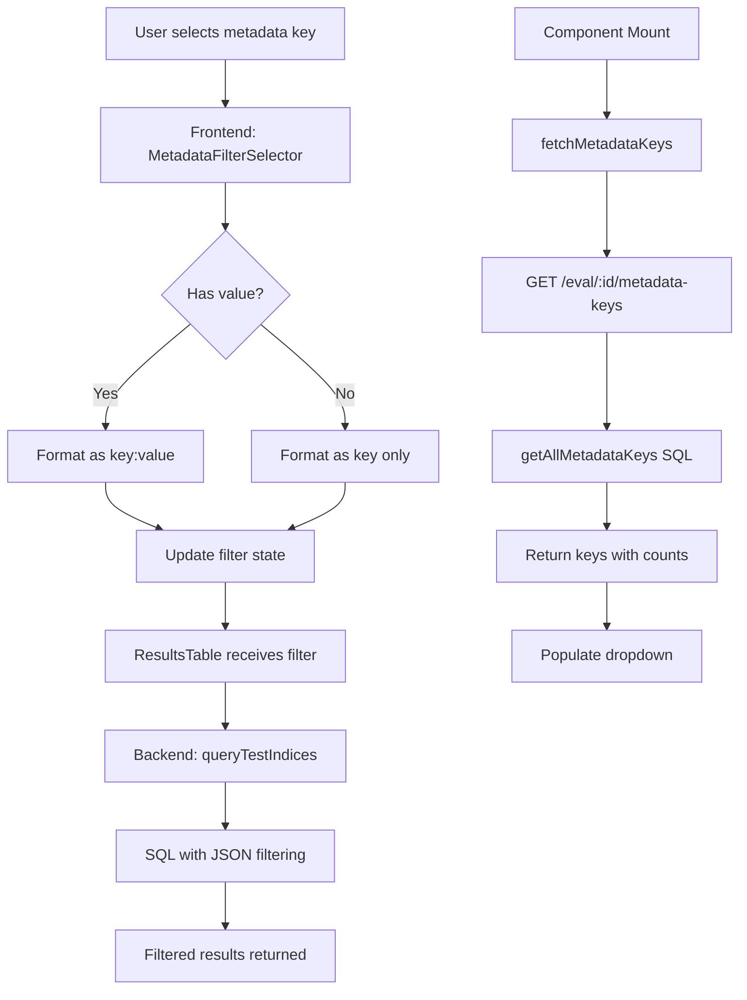

# Metadata Filter Technical Specification

## Overview

The metadata filter feature enables filtering of evaluation results based on metadata key-value pairs attached to test cases. This document details the technical implementation.

## Data Flow



## API Specification

### GET /api/eval/:id/metadata-keys

Fetches all unique metadata keys for a given evaluation.

**Request:**

```http
GET /api/eval/abc123/metadata-keys
```

**Response:**

```json
{
  "keys": ["model", "strategy", "version", "temperature"],
  "counts": {
    "model": 150,
    "strategy": 150,
    "version": 75,
    "temperature": 50
  }
}
```

**Implementation:**

```sql
SELECT DISTINCT json_each.key as metadata_key,
       COUNT(*) as count
FROM results_test_cases,
     json_each(CASE
       WHEN json_valid(metadata) THEN metadata
       ELSE '{}'
     END)
WHERE evalId = ?
GROUP BY metadata_key
ORDER BY metadata_key;
```

## Frontend Components

### MetadataFilterSelector

**Props:**

```typescript
interface MetadataFilterSelectorProps {
  selectedMetadata: string | null;
  availableMetadata: string[];
  onChange: (metadata: string | null) => void;
  metadataCounts?: Record<string, number>;
  isLoading?: boolean;
}
```

**State Management:**

```typescript
// In useTableStore
interface TableState {
  // ... existing state
  availableMetadata: string[];
  metadataCounts: Record<string, number>;
  isLoadingMetadata: boolean;
}

actions: {
  fetchMetadataKeys: async (evalId: string) => {
    set({ isLoadingMetadata: true });
    try {
      const response = await fetch(`/api/eval/${evalId}/metadata-keys`);
      const data = await response.json();
      set({
        availableMetadata: data.keys || [],
        metadataCounts: data.counts || {},
        isLoadingMetadata: false,
      });
    } catch (error) {
      set({ isLoadingMetadata: false });
    }
  };
}
```

## Filter Format

### Key-Only Filter

Filters for any test case that has the specified metadata key, regardless of value.

**Format:** `"model"`  
**SQL:** `json_extract(metadata, '$.model') IS NOT NULL`

### Key-Value Filter

Filters for test cases where the metadata key has a specific value.

**Format:** `"model:gpt-4"`  
**SQL:** `json_extract(metadata, '$.model') = 'gpt-4'`

### Wildcard Patterns

| Pattern        | Description | SQL                                               |
| -------------- | ----------- | ------------------------------------------------- |
| `key:value`    | Exact match | `json_extract(metadata, '$.key') = 'value'`       |
| `key:prefix*`  | Starts with | `json_extract(metadata, '$.key') LIKE 'prefix%'`  |
| `key:*suffix`  | Ends with   | `json_extract(metadata, '$.key') LIKE '%suffix'`  |
| `key:*middle*` | Contains    | `json_extract(metadata, '$.key') LIKE '%middle%'` |

## Backend Implementation

### queryTestIndices Function

Modified to support metadata filtering:

```typescript
if (metadataFilter) {
  const colonIndex = metadataFilter.indexOf(':');

  if (colonIndex === -1) {
    // Key-only filter
    conditions.push(`json_extract(r.metadata, '$.${metadataFilter}') IS NOT NULL`);
  } else {
    // Key:value filter
    const key = metadataFilter.substring(0, colonIndex);
    const value = metadataFilter.substring(colonIndex + 1);

    if (value.includes('*')) {
      // Wildcard pattern
      const sqlPattern = value.replace(/\*/g, '%');
      conditions.push(`json_extract(r.metadata, '$.${key}') LIKE ?`);
      params.push(sqlPattern);
    } else {
      // Exact match
      conditions.push(`json_extract(r.metadata, '$.${key}') = ?`);
      params.push(value);
    }
  }
}
```

## State Synchronization

### Filter Reset on Eval Change

```typescript
// In ResultsView.tsx
React.useEffect(() => {
  if (evalId) {
    fetchMetadataKeys(evalId);
    setSelectedMetadata(null); // Reset filter
  }
}, [evalId, fetchMetadataKeys]);
```

### Filter Chip Display

```typescript
{selectedMetadata && (
  <Chip
    size="small"
    label={
      selectedMetadata.includes(':')
        ? `Metadata: ${selectedMetadata}`
        : `Metadata: ${selectedMetadata} (any value)`
    }
    onDelete={() => handleMetadataFilterChange(null)}
  />
)}
```

## Performance Considerations

### Current Implementation

- Metadata keys fetched on every eval load
- No caching between eval switches
- Count calculation in same query as key extraction
- All results filtered in SQL (good for performance)

### Optimization Opportunities

1. **Client-side caching:** Cache metadata keys with TTL
2. **Lazy count loading:** Load counts separately or on-demand
3. **Indexed columns:** Add index on metadata JSON field
4. **Pagination:** For evals with many unique metadata keys

## Security Considerations

### SQL Injection Prevention

- Parameterized queries for values
- Key names inserted directly into SQL (potential risk)
- Should validate key names against pattern: `/^[a-zA-Z0-9_.-]+$/`

### Recommended Validation

```typescript
function validateMetadataKey(key: string): boolean {
  return /^[a-zA-Z0-9_.-]+$/.test(key);
}
```

## Testing Strategy

### Unit Tests Required

1. **MetadataFilterSelector Component**
   - Renders dropdown with available keys
   - Shows value input when key selected
   - Handles Enter key press
   - Clear button functionality
   - Loading state display

2. **Backend Endpoint**
   - Returns correct metadata keys
   - Handles missing metadata
   - Validates evalId parameter
   - Counts are accurate

3. **Filter Application**
   - Key-only filtering works
   - Key:value filtering works
   - Wildcard patterns work
   - SQL injection prevention

### Integration Tests

1. Filter persists during pagination
2. Filter combines with other filters (search, pass/fail)
3. Filter resets on eval change
4. Performance with large metadata sets

## Known Issues

1. **No value suggestions:** Users must know exact values
2. **Single filter limitation:** Cannot combine multiple metadata filters
3. **No numeric comparisons:** Only string matching supported
4. **Case sensitivity:** Filters are case-sensitive
5. **Nested metadata:** Cannot filter on nested JSON properties

## Migration Guide

For users upgrading to use metadata filtering:

1. Ensure metadata is stored as valid JSON in test cases
2. Use consistent key naming across test cases
3. String values work best (numbers are converted to strings)
4. Avoid special characters in metadata keys

## Future API Changes

### Proposed Enhanced Filter API

```typescript
// Support multiple filters
GET /api/eval/:id/results?metadata_filters=[
  { key: "model", op: "eq", value: "gpt-4" },
  { key: "score", op: "gt", value: "0.8" },
  { key: "tags", op: "contains", value: "production" }
]

// Support metadata value autocomplete
GET /api/eval/:id/metadata-values?key=model
Response: ["gpt-4", "gpt-3.5-turbo", "claude-3"]
```
