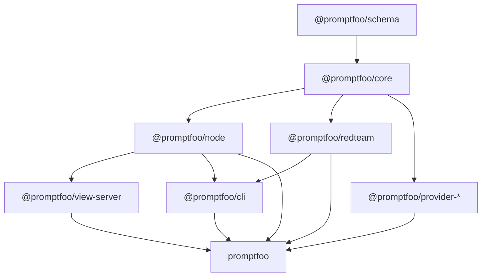

# Proposal: A Layered Package System for Promptfoo

## Executive Summary

Promptfoo should move from "one published package that happens to contain many
systems" to "one familiar full package backed by a small set of explicit package
layers."

The recommendation is:

1. Keep `promptfoo` as the default full install and compatibility facade.
2. Create private workspace packages first, then publish only the packages whose
   boundaries prove useful.
3. Separate the low-dependency evaluation kernel from Node adapters, CLI,
   server/UI hosting, redteam, and provider families.
4. Make dependency ownership visible and test the packed artifacts users install,
   not only the source tree.
5. Preserve dual ESM/CommonJS support at public package boundaries during the
   transition.

This gives lightweight consumers a smaller dependency graph without making the
normal `npm install promptfoo` experience worse. It also gives the team a safer
path to provider packs and future products without forcing a flag day.

## Why Change

Today, the published root package owns several quite different responsibilities:

- Node library entrypoint
- CLI
- evaluation engine
- database and migrations
- sharing and persistence
- view server
- redteam workflows
- many provider SDKs
- the built web UI

That makes the root package convenient, but also broad:

- The root package currently has `83` direct runtime dependencies and `36`
  optional dependencies.
- Before this prototype, the public library entrypoint in `src/index.ts`
  imported migrations, models, sharing, provider loading, and redteam APIs.
  The prototype starts separating that shape by moving the public Node API
  behind `src/node/evaluate.ts`, while the internal orchestration stays in the
  Node layer at `src/evaluate.ts` and `promptfoo` remains the facade.
- `src/main.ts` and `src/commands/view.ts` are already outer-shell concerns,
  not core evaluation concerns.
- Provider loading is centralized enough that optional/provider dependencies are
  still effectively part of the product shape.

The system has grown past the point where one package boundary expresses the
architecture well.

## Non-Goals

- Do not make existing users choose packages on day one.
- Do not publish every internal boundary just because it exists.
- Do not require a package-manager migration before the architecture improves.
- Do not turn providers into runtime-installed plugins as a prerequisite for the
  split.
- Do not combine the package split with an ESM-only migration.

## Design Principles

1. **One obvious default.**
   `promptfoo` remains the package most users install.

2. **Narrow leaves, convenient facade.**
   Lightweight consumers should not pay for servers, databases, CLIs, or provider
   SDKs they do not use.

3. **No runtime dependency magic.**
   Dependency installation happens at install/build/publish time, not when an eval
   starts or a server boots.

4. **Private boundaries before public promises.**
   We should first make internal ownership real inside the monorepo, then publish
   only the packages that survive real use.

5. **Dual-format correctness over format ideology.**
   Promptfoo already supports both ESM and CommonJS. Public packages should keep
   doing that until we intentionally decide otherwise.

6. **Package artifacts are the contract.**
   A source-tree green build is not enough; every published package must be packed,
   installed, imported, required, and exercised as a user would consume it.

## Recommended Package Topology



### `@promptfoo/schema`

**Purpose**

- Config types and runtime schemas
- JSON schema generation
- Browser-safe shared contracts
- Stable serialized result shapes where appropriate

**May depend on**

- schema libraries such as `zod`

**Must not depend on**

- `fs`, `better-sqlite3`, Express, provider SDKs, CLI libraries, server code

**Why it exists**

- It is the cleanest shared layer between library, CLI, server, UI, and docs.
- It is also the safest first extraction.

### `@promptfoo/core`

**Purpose**

- Pure evaluation domain model
- Test planning, prompt expansion, assertions, scoring, result aggregation
- Provider/assertion interfaces
- No direct filesystem, DB, HTTP-server, or provider-SDK assumptions

**May depend on**

- `@promptfoo/schema`
- small domain utilities

**Must not depend on**

- persistence
- web server
- CLI
- concrete provider SDK packages

**Why it exists**

- This is the actual reusable engine people mean when they say "the Node package."
- It should be possible to run it with fake providers and in-memory adapters.

### `@promptfoo/node`

**Purpose**

- Node adapters around core
- config/file loading
- local persistence
- migrations
- cache
- share/report persistence helpers
- current `evaluate()`-style Node API

**May depend on**

- `@promptfoo/core`
- `@promptfoo/schema`
- Node-only dependencies such as `better-sqlite3`, `glob`, `chokidar`, `dotenv`

**Why it exists**

- Most library users still want the batteries-included Node API.
- This gives them that without forcing the same dependencies onto future
  browser-safe or embedded consumers.

### `@promptfoo/redteam`

**Purpose**

- redteam generation, strategies, graders, plugins, reporting

**May depend on**

- `@promptfoo/core`
- `@promptfoo/node` only where it truly needs Node adapters
- redteam-specific dependencies

**Why it exists**

- Redteam is now a substantial product surface with its own cadence,
  dependencies, docs, and CLI flows.

### `@promptfoo/view-server`

**Purpose**

- Express/socket server
- API routes
- static app serving
- local UI hosting

**May depend on**

- `@promptfoo/node`
- server-specific dependencies

**Why it exists**

- The server is useful, but it is not intrinsic to every library consumer.

### `@promptfoo/cli`

**Purpose**

- command registration
- process lifecycle
- update checks
- terminal UX
- orchestration across `node`, `redteam`, and `view-server`

**May depend on**

- `@promptfoo/node`
- `@promptfoo/redteam`
- `@promptfoo/view-server`

**Why it exists**

- The CLI is a shell around the system, not the system itself.

### `@promptfoo/provider-*`

**Purpose**

- Provider-specific implementations and SDK dependencies
- Examples:
  - `@promptfoo/provider-openai`
  - `@promptfoo/provider-anthropic`
  - `@promptfoo/provider-aws`
  - `@promptfoo/provider-google`
  - eventually a small `@promptfoo/providers-core` for zero-extra-dependency or
    very common providers

**May depend on**

- `@promptfoo/core`
- provider SDKs owned by that package

**Why it exists**

- This is where the largest optional dependency savings eventually come from.
- It also makes provider ownership and release notes much clearer.

**Important**

- Do not start by publishing dozens of provider packages.
- First make provider registration explicit and let built-in providers move behind
  the same registry shape internally.

### `promptfoo`

**Purpose**

- Familiar full package
- current CLI binaries
- compatibility imports
- "everything included" experience

**Behavior**

- Depends on the packages that define the full Promptfoo distribution.
- Re-exports the stable Node API from `@promptfoo/node`.
- Continues to ship the CLI users know.
- Becomes the migration shield while the rest of the topology matures.

## Dependency Policy

### Ownership Rule

Every runtime dependency must have one declared owner:

- core runtime
- node runtime
- cli runtime
- view-server runtime
- redteam runtime
- provider runtime
- docs/app/dev-only

If a dependency is used by more than one package, we should prefer:

1. a smaller shared package only when the shared code is real, or
2. duplicate declarations when the runtime ownership is legitimately separate.

Do not keep dependencies at the root merely because multiple packages happen to
use them during the transition.

### Boundary Rule

- A package may import only from packages below it in the topology.
- No package may deep-import another package's `src/**`.
- Public imports go through explicit package exports.
- UI code depends on schema/browser-safe contracts, not Node internals.

### Provider Rule

- Provider SDK dependencies belong to provider packages.
- `core` knows only provider interfaces and registration metadata.
- `node` may ship a default provider registry, but should not be the owner of every
  provider SDK forever.

### Optional Dependency Rule

- Use `optionalDependencies` only for genuinely optional platform/native
  capability, not as a substitute for package ownership.
- Once a provider family has its own package, its SDK should leave the root
  optional-dependency bucket.

## Build and Repository Model

### Keep npm Workspaces for the First Stage

The repository already uses npm workspaces and has established CI around them.
The split does not require an immediate package-manager migration.

Recommended first-stage workspace layout:

```text
packages/
  schema/
  core/
  node/
  redteam/
  view-server/
  cli/
  provider-openai/
  provider-anthropic/
src/app/
site/
```

`src/` can migrate inward over time. During the first phase, thin package entry
files may point at existing source while we move code by ownership.

### Build Outputs

Each publishable package should produce:

```text
dist/
  esm/
  cjs/
  types/
```

and expose only supported entrypoints through `exports`.

Recommended package export shape:

```json
{
  "type": "module",
  "exports": {
    ".": {
      "types": "./dist/types/index.d.ts",
      "import": "./dist/esm/index.js",
      "require": "./dist/cjs/index.cjs"
    }
  }
}
```

For Node-targeted packages, TypeScript should be checked in `nodenext` mode so
the compiler models Node's dual-format resolver. Browser/bundler packages can
keep bundler-oriented settings where appropriate.

### Package Boundary Checks

Add CI checks for:

- illegal cross-package imports
- public-export drift
- missing dependency declarations
- duplicate accidental dependencies
- root dependency ownership
- packed-tarball contents
- ESM import smoke
- CommonJS require smoke
- type-resolution smoke

The strongest useful addition from the OpenClaw study is a generated dependency
ownership report:

```text
dependency                owner                  direct users       transitive size
better-sqlite3             @promptfoo/node        node               ...
express                    @promptfoo/view-server view-server        ...
@anthropic-ai/sdk          provider-anthropic     provider package   ...
```

That report should fail CI when:

- a dependency has no owner
- a package imports a dependency it does not declare
- a dependency owned by a leaf is still imported from a higher layer

### What We Should Borrow From OpenClaw

The useful lesson from OpenClaw is not "copy its exact repo layout." It is that
dependency management gets simpler when ownership is explicit and package
artifacts are tested like user-facing products.

Adopt:

- private workspaces as the first architectural boundary
- leaf-package ownership of runtime dependencies
- dependency ownership reports in CI
- tarball checks and clean-install acceptance tests
- install/update flows that are explicit, never hidden inside startup paths

Do not adopt blindly:

- an immediate package-manager migration
- runtime-installable provider plugins before Promptfoo needs that product model
- ESM-only publishing while Promptfoo still supports both `import` and `require`

## Publishing Model

### Recommendation: One Version Line at First

Use a fixed-version monorepo release for the first public split:

- all public `@promptfoo/*` packages share the same version
- `promptfoo` depends on exact matching versions of internal public packages
- release notes can still call out package-specific changes

This is easier for users, support, and rollback while boundaries are still
forming. Independent versions become worth revisiting only after package
consumption patterns are stable.

### Release Automation

Keep release automation centralized and extend the current flow rather than
inventing a second release system immediately:

1. build all publishable packages
2. run package-graph checks
3. pack each package
4. install packed artifacts into clean temp projects
5. run ESM, CJS, CLI, server, and upgrade smokes
6. publish with npm trusted publishing / provenance
7. publish the `promptfoo` facade last

Promptfoo already publishes with provenance in the current release workflow, so
this should be an extension of the existing release path rather than a parallel
system.

### Artifact Acceptance

Before publish, every public package should prove:

- `npm pack` contents are complete
- no source-only files are required at runtime
- `import` works
- `require` works
- TypeScript resolves exported types
- `promptfoo` facade still exposes current behavior
- upgrade from the last published version works for the top-level package

The current smoke-test philosophy already says "test the built package, not
source code." This proposal extends that idea from the root package to every
public package.

## ESM and CommonJS Strategy

Promptfoo should remain dual-mode during the split.

### Rules

- Public packages ship both `import` and `require` conditions until we make a
  separate deprecation decision.
- Source-of-truth implementation may remain ESM-first.
- CJS builds are compatibility artifacts, not a second architecture.
- No package may rely on unexported internal paths from another package.
- Every public package gets both `import` and `require` smoke tests.

### Why

Modern Node can load more ESM from CommonJS than older Node versions could, but
Promptfoo already promises a `require` entrypoint today. Keeping that promise
while the package graph changes avoids combining two migrations into one.

## Developer Experience

The system should feel no worse locally than the repo does today.

### Required Properties

- one install at the repo root
- one normal full build command
- package-local test commands when working narrowly
- no manual linking
- no publishing knowledge required for ordinary feature work
- docs/examples keep using `promptfoo` unless a smaller package is the point of
  the example

### Useful Commands

```bash
npm run build
npm test
npm run test:package -- --package @promptfoo/node
npm run deps:ownership
npm run pack:check
```

### Golden Path

Most contributors should continue to:

1. install once
2. edit one package or normal source file
3. run focused tests
4. run the normal repo checks before merging

Package boundaries should make reasoning easier, not force every engineer to
become a release engineer.

## Documentation System

### New Docs to Add

1. `docs/architecture/packages.md`
   - package graph
   - dependency rules
   - when to add a package

2. `docs/agents/package-development.md`
   - how to choose the owning package
   - package-boundary checks
   - ESM/CJS export rules

3. `site/docs/usage/packages.md`
   - "which package should I install?"
   - full package vs lightweight library vs provider packs

4. Per-package README template
   - purpose
   - install
   - supported imports
   - dependency notes
   - compatibility guarantees

### Public Message

For users, the story should be simple:

- Install `promptfoo` when you want the normal product.
- Install `@promptfoo/node` when you want the Node library without the CLI/server.
- Install provider packages only when you want explicit fine-grained control.

## Migration Plan

### Phase 0: Add Guardrails Without Moving Code

- add dependency ownership inventory
- add package-artifact smoke harness
- add package-boundary linting
- add architecture docs

**Exit criterion**

- We can explain which dependency belongs to which future package.

### Phase 1: Extract the Safest Layers Privately

- create private workspaces for `schema`, `core`, and `node`
- move exports and types behind those boundaries
- keep `promptfoo` behavior unchanged

**Exit criterion**

- Existing CLI and Node consumers pass unchanged through the facade.

### Phase 2: Split Outer Shells Privately

- create private `cli` and `view-server`
- move server dependencies out of node/core
- move command orchestration out of the library layer

**Exit criterion**

- `@promptfoo/node` can build and test without CLI/server dependencies.

### Phase 3: Make Provider Registration Explicit

- define provider registration API
- move a small pilot set behind provider packages internally
- start with packages that have obvious heavy dependencies or ownership

**Exit criterion**

- Providers can be loaded through one registry path whether bundled or packaged.

### Phase 4: Publish the First Useful Subpackages

Recommended first public packages:

1. `@promptfoo/schema`
2. `@promptfoo/node`
3. `@promptfoo/view-server`

Keep `promptfoo` as the full facade.

**Exit criterion**

- Real users can consume the smaller packages without undocumented imports or
  hidden dependencies.

### Phase 5: Publish Provider Packs Selectively

Only publish provider packages where there is a clear benefit:

- large SDK footprint
- unusual native/platform dependency
- clear ownership
- meaningful install-size reduction
- independent release pressure

**Exit criterion**

- Provider packages reduce the root graph without making provider selection
  confusing.

## Alternatives Considered

### A. Keep One Package Forever

**Pros**

- simplest publishing story
- zero package churn

**Cons**

- dependency graph keeps growing
- library consumers keep paying for unrelated surfaces
- harder ownership and release reasoning

### B. Split Everything Immediately

**Pros**

- cleanest theoretical end state

**Cons**

- too many public promises at once
- high migration risk
- poor signal about which boundaries users actually need

### C. Recommended: Layered Split With a Facade

**Pros**

- gives smaller packages to users who need them
- keeps today's default UX
- makes ownership real before multiplying public APIs
- lets us stop after any phase if the benefits flatten out

**Cons**

- a transitional period with some duplicated packaging work
- requires disciplined export and dependency checks

## Risks and Mitigations

| Risk                                          | Mitigation                                                                      |
| --------------------------------------------- | ------------------------------------------------------------------------------- |
| Internal package churn leaks into public API  | Publish only after private boundary use stabilizes                              |
| Dual ESM/CJS builds become inconsistent       | Artifact smokes for both import modes on every public package                   |
| Developers slow down in a new monorepo layout | Keep root install/build/test commands as the golden path                        |
| Provider package count becomes confusing      | Publish provider packs selectively; keep `promptfoo` full install               |
| Version skew across packages                  | Start with fixed versions and exact internal deps                               |
| Release workflow becomes fragile              | Reuse current release pipeline, add package-graph and tarball acceptance checks |

## Decisions Requested

1. Approve the layered topology as the target direction.
2. Approve a private-workspace-first migration rather than immediate public
   package proliferation.
3. Approve `promptfoo` as the long-lived full facade.
4. Approve fixed-version public packages for the first release cycle.
5. Approve dual ESM/CommonJS support for all first-wave public packages.
6. Approve investment in dependency ownership and package-acceptance CI before
   publishing subpackages.

## First Concrete Milestone

The first milestone should be deliberately modest:

1. Add dependency ownership reporting.
2. Create private `packages/schema`, `packages/core`, and `packages/node`.
3. Move the public Node API behind `@promptfoo/node` while keeping
   `promptfoo` exports unchanged.
4. Prove that `@promptfoo/node` can build and test without CLI/server imports.
5. Add packed-artifact smoke tests for the root package and the private node
   package.

If that milestone is not useful, we learn cheaply. If it is useful, the rest of
the package system has a clear path.

## Appendix: Current-Code Signals

- Before this prototype, `src/index.ts` mixed the Node API with migrations,
  sharing, provider loading, and redteam exports. The prototype moves the Node
  orchestration into `src/node/evaluate.ts` as the first concrete seam.
- `src/main.ts` is already a CLI shell around lower-level functionality.
- `src/commands/view.ts` and `src/server/**` are natural `view-server` owners.
- `src/providers/**` is already a natural future provider-package boundary.
- `src/types/index.ts` is already being deconstructed, which points toward
  `schema` as a first extraction.

## Appendix: 2026 Packaging Notes

- Use explicit `exports` maps for public packages.
- For Node-targeted packages, type-check in `nodenext` mode so TypeScript models
  the same `import`/`require` behavior Node uses.
- Keep npm trusted publishing / provenance in the release path for every public
  package.
- Treat `npm pack` plus clean-install smoke tests as the release contract, not an
  optional extra.

## References

- [Node.js package exports documentation](https://nodejs.org/api/packages.html)
- [TypeScript module-system reference](https://www.typescriptlang.org/docs/handbook/modules/reference)
- [npm trusted publishing documentation](https://docs.npmjs.com/trusted-publishers)
- [npm provenance documentation](https://docs.npmjs.com/generating-provenance-statements)
- [npm workspaces documentation](https://docs.npmjs.com/cli/v8/using-npm/workspaces/)
