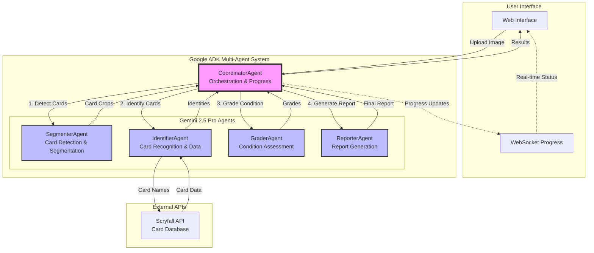

# MTG Card Analyzer - Google ADK Example

An AI-powered Magic: The Gathering card analyzer built with Google's Agent Development Kit (ADK). This example demonstrates a multi-agent system that can detect, identify, grade, and generate reports for MTG cards from images using **Gemini 2.5 Pro's** advanced vision capabilities.

## 🎯 Overview

This example showcases how to build a sophisticated multi-agent application using Google ADK with Gemini 2.5 Pro:

- **Segments** cards from images using Gemini 2.5 Pro's native segmentation capabilities
- **Identifies** cards using Gemini 2.5 Pro vision with batch processing
- **Grades** card condition with precise TCGPlayer/PSA standards using Gemini 2.5 Pro
- **Generates** comprehensive reports with market data using Gemini 2.5 Pro

The entire pipeline runs on Gemini 2.5 Pro with no local models required, featuring real-time progress tracking via WebSocket.

## 🏗️ Architecture



### Agent Responsibilities

1. **CoordinatorAgent**: Orchestrates the pipeline, manages parallel processing, and streams progress updates
2. **SegmenterAgent**: Uses Gemini 2.5 Pro's vision to detect and segment individual cards with bounding boxes
3. **IdentifierAgent**: Identifies cards using Gemini 2.5 Pro vision, enriches with Scryfall data
4. **QualityGraderAgent**: Applies professional grading standards with detailed criteria for centering, corners, edges, and surface
5. **ReportGeneratorAgent**: Creates comprehensive JSON/PDF reports with analysis and market data

## 📋 Prerequisites

- Python 3.11+
- Google Cloud account with Gemini API access
- No GPU required - all processing happens via Gemini 2.5 Pro API

## 🚀 Quick Start

### 1. Clone and Navigate

```bash
cd examples/adk-mtg-card-analyzer
```

### 2. Install Dependencies

```bash
pip install -r requirements.txt
```

### 3. Set Up Environment

The example will automatically use the GOOGLE_API_KEY from the promptfoo root `.env` file if available.

**Note:** Make sure to uncomment the GOOGLE_API_KEY line in the root `.env` file:
```bash
# In /path/to/promptfoo/.env
GOOGLE_API_KEY=your_actual_api_key_here
```

Alternatively, you can create a local `.env` file in this directory:
```bash
cp .env.example .env
# Edit .env and add your Google API key
```

### 4. Run the Application

No model downloads required! Everything runs through Gemini 2.5 Pro API.

### 5. Run the Application

#### CLI Mode
```bash
python main.py
```

#### Web Server Mode
```bash
python server.py
```

Then open http://localhost:8000 in your browser.

## 🎮 Usage

### Web Interface

1. Open http://localhost:8000
2. Upload an image containing MTG cards
3. Click "Analyze Cards"
4. Watch real-time progress updates
5. View detailed results for each card

### API Endpoints

- `POST /api/analyze` - Analyze an uploaded image
- `GET /api/status` - Get pipeline status
- `POST /api/build-index` - Build demo card index
- `WS /ws` - WebSocket for progress updates

### Python API

```python
from agents.coordinator import CoordinatorAgent

# Initialize coordinator
coordinator = CoordinatorAgent()

# Analyze an image
result = await coordinator.analyze_image(
    image_path="path/to/cards.jpg",
    output_format="json"  # or "pdf"
)
```

## 📊 Output Format

The analyzer returns detailed JSON with:

```json
{
  "report_id": "rpt_20250125_123456",
  "timestamp": "2025-01-25T12:34:56",
  "total_cards": 3,
  "cards": [
    {
      "position": 1,
      "identity": {
        "name": "Lightning Bolt",
        "set_code": "LEA",
        "collector_number": "161"
      },
      "grade": {
        "tcg_condition": "NM",
        "psa_equivalent": "9",
        "confidence": 0.92,
        "overall_score": 9.2
      },
      "evidence": [
        {
          "category": "centering",
          "score": 9.5,
          "description": "Well centered (TB: 0.92, LR: 0.89)"
        }
      ],
      "estimated_value": {
        "low": 80.00,
        "mid": 100.00,
        "high": 120.00
      }
    }
  ]
}
```

## 🔧 Configuration

### Agent Parameters

Modify agent behavior in `agents/coordinator.py`:

```python
coordinator = CoordinatorAgent(
    max_parallel_cards=16,     # Max cards to process in parallel
    enable_caching=True,       # Cache results for duplicate cards
    progress_callback=callback # Custom progress handler
)
```

### Grading Thresholds

Adjust grading criteria in `agents/grader.py`:

- TCGPlayer conditions (NM, LP, MP, HP, DMG)
- PSA grades (1-10)
- Custom scoring weights

## 📁 Project Structure

```
adk-mtg-card-analyzer/
├── agents/                 # Agent implementations
│   ├── base.py            # Base classes and data models
│   ├── segmenter.py       # Card detection agent
│   ├── identifier.py      # Card identification agent
│   ├── grader.py          # Condition grading agent
│   ├── reporter.py        # Report generation agent
│   └── coordinator.py     # Multi-agent coordinator
├── static/                # Web interface files
│   └── index.html         # Main web UI
├── data/                  # Model checkpoints and indices
├── reports/               # Generated reports
├── samples/               # Sample images
├── main.py               # CLI entry point
├── server.py             # Web server
├── requirements.txt      # Python dependencies
└── README.md            # This file
```

## 🧪 Testing

1. Add sample card images to `samples/` directory
2. Run the analyzer:
   ```bash
   python main.py
   ```
3. Check generated reports in `reports/` directory

## 🎯 ADK Features Demonstrated

This example showcases key ADK capabilities:

- **Multi-Agent Orchestration**: Coordinator manages multiple specialized agents
- **Model Flexibility**: Gemini 2.5 Pro for vision and text generation, SAM for segmentation
- **Batch Vision Processing**: Efficient multi-image analysis in single Gemini calls
- **Hybrid Analysis**: Combines traditional CV algorithms with LLM vision capabilities
- **Async Processing**: Parallel processing of multiple cards
- **Progress Tracking**: Real-time updates via WebSocket
- **Session Management**: Maintains context across agent calls
- **Error Handling**: Graceful fallbacks and robust error recovery

## ⚡ Performance Tips

1. **Batch Processing**: Gemini 2.5 Pro processes multiple cards in single API calls
2. **Parallel Agents**: Multiple agents can run concurrently for different cards
3. **Caching**: Enable caching for duplicate card detection
4. **API Rate Limits**: Monitor your Gemini API usage for optimal performance

## 🚧 Limitations

- Requires Gemini 2.5 Pro API access with vision capabilities
- API rate limits may affect processing speed for large batches
- Grading accuracy depends on image quality

## 🔮 Future Enhancements

- Fine-tune SAM on foiled/holographic cards
- Add price forecasting using historical data
- Implement conversational follow-ups with Gemini
- Support for other TCGs (Pokemon, Yu-Gi-Oh)

## 📚 Resources

- [Google ADK Documentation](https://google.github.io/adk-docs/)
- [ADK GitHub Repository](https://github.com/google/adk-python)
- [Segment Anything Model](https://github.com/facebookresearch/segment-anything)
- [CLIP Model](https://github.com/openai/CLIP)

## 📄 License

This example is provided as-is for educational purposes. MTG card images and data are property of Wizards of the Coast.