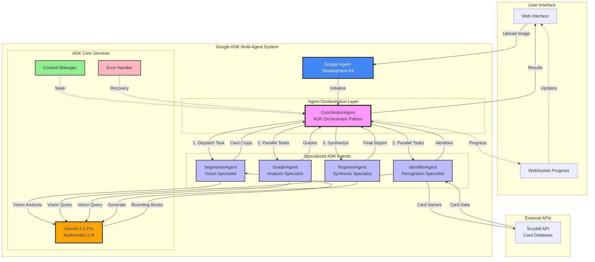

# MTG Card Analyzer - Google ADK Multi-Agent Example

An AI-powered Magic: The Gathering card analyzer built with Google's Agent Development Kit (ADK) and powered by **Gemini 2.5 Pro**. This example demonstrates how to build a sophisticated multi-agent system using Google ADK that can detect, identify, grade, and generate reports for MTG cards from images.

## 🎯 Overview

This example showcases Google's Agent Development Kit (ADK) for building sophisticated multi-agent applications:

- **Agent Orchestration**: Uses Google ADK's multi-agent coordination capabilities
- **Multiple Segmentation Options**:
  - **SAM2**: State-of-the-art Segment Anything Model 2 with automatic aspect ratio correction
  - **GenAI**: Multi-stage reasoning with Gemini 2.5 Pro
  - **Advanced**: Hybrid CV + Gemini approach
  - **Basic**: Pure Gemini 2.5 Pro detection
- **Identifies** cards using Gemini 2.5 Pro vision with batch processing
- **Grades** card condition with precise TCGPlayer/PSA standards
- **Generates** comprehensive reports with market data
- **Real-time Progress**: WebSocket updates for live pipeline monitoring

Combines state-of-the-art segmentation (SAM2) with Gemini 2.5 Pro's analysis capabilities.

## 🏗️ Architecture



### ADK Agent Architecture

The system follows Google ADK's multi-agent design patterns:

1. **CoordinatorAgent** (Orchestrator Pattern): 
   - Manages the agent pipeline and task distribution
   - Implements ADK's coordinator pattern for parallel agent execution
   - Streams real-time progress updates

2. **SegmenterAgent** (Vision Specialist): 
   - Leverages Gemini 2.5 Pro's vision capabilities for card detection
   - Returns normalized bounding boxes for downstream agents

3. **IdentifierAgent** (Recognition Specialist): 
   - Uses Gemini 2.5 Pro for visual card identification
   - Enriches results with external data (Scryfall API)
   - Implements batch processing for efficiency

4. **QualityGraderAgent** (Analysis Specialist): 
   - Applies professional TCGPlayer/PSA grading standards
   - Provides detailed evidence-based assessments
   - Uses structured prompts for consistent grading

5. **ReportGeneratorAgent** (Synthesis Specialist): 
   - Aggregates results from all agents
   - Generates structured JSON/PDF reports
   - Implements ADK's report generation patterns

## 📋 Prerequisites

- Python 3.11+
- Google Cloud account with Gemini API access
- Google ADK Python SDK (installed via requirements.txt)
- No GPU required - all processing happens via Gemini 2.5 Pro API

## 🚀 Quick Start

### 1. Clone and Navigate

```bash
cd examples/adk-mtg-card-analyzer
```

### 2. Install Dependencies

```bash
pip install -r requirements.txt
```

#### Optional: Install SAM2 for Advanced Segmentation

For the best segmentation results using SAM2:

```bash
# Run the setup script
chmod +x setup_sam2.sh
./setup_sam2.sh

# Or manually:
# 1. Install PyTorch
pip install torch>=2.5.1 torchvision>=0.20.1

# 2. Clone and install SAM2
git clone https://github.com/facebookresearch/sam2.git
cd sam2 && pip install -e . && cd ..

# 3. Download checkpoints from https://github.com/facebookresearch/sam2#model-checkpoints
# Place in checkpoints/ directory
```

### 3. Set Up Environment

The example will automatically use the GOOGLE_API_KEY from the promptfoo root `.env` file if available.

**Note:** Make sure to uncomment the GOOGLE_API_KEY line in the root `.env` file:
```bash
# In /path/to/promptfoo/.env
GOOGLE_API_KEY=your_actual_api_key_here
```

Alternatively, you can create a local `.env` file in this directory:
```bash
cp .env.example .env
# Edit .env and add your Google API key
```

### 4. Run the Application

No model downloads required! Everything runs through Gemini 2.5 Pro API.

### 5. Run the Application

#### CLI Mode
```bash
# Default (GenAI segmentation)
python main.py

# With SAM2 segmentation (best quality)
python main.py --segmentation-mode sam2

# Analyze specific image
python main.py --image path/to/cards.jpg --output-format pdf

# Available options:
# --segmentation-mode: basic, advanced, genai, sam2
# --image: path to image file
# --output-format: json or pdf
```

#### Web Server Mode
```bash
python server.py
```

Then open http://localhost:8000 in your browser.

## 🎮 Usage

### Web Interface

1. Open http://localhost:8000
2. Upload an image containing MTG cards
3. Click "Analyze Cards"
4. Watch real-time progress updates
5. View detailed results for each card

### API Endpoints

- `POST /api/analyze` - Analyze an uploaded image
- `GET /api/status` - Get pipeline status
- `POST /api/build-index` - Build demo card index
- `WS /ws` - WebSocket for progress updates

### Python API

```python
from agents.coordinator import CoordinatorAgent

# Initialize coordinator
coordinator = CoordinatorAgent()

# Analyze an image
result = await coordinator.analyze_image(
    image_path="path/to/cards.jpg",
    output_format="json"  # or "pdf"
)
```

## 📊 Output Format

The analyzer returns detailed JSON with token usage and cost tracking:

```json
{
  "report_id": "rpt_20250125_123456",
  "timestamp": "2025-01-25T12:34:56",
  "total_cards": 3,
  "cards": [
    {
      "position": 1,
      "identity": {
        "name": "Lightning Bolt",
        "set_code": "LEA",
        "collector_number": "161"
      },
      "grade": {
        "tcg_condition": "NM",
        "psa_equivalent": "9",
        "confidence": 0.92,
        "overall_score": 9.2
      },
      "evidence": [
        {
          "category": "centering",
          "score": 9.5,
          "description": "Well centered (TB: 0.92, LR: 0.89)"
        }
      ],
      "estimated_value": {
        "low": 80.00,
        "mid": 100.00,
        "high": 120.00
      }
    }
  ],
  "metadata": {
    "processing_time_seconds": 12.5,
    "cards_detected": 3,
    "cards_analyzed": 3,
    "token_usage": {
      "total_tokens": 15420,
      "total_prompt_tokens": 12300,
      "total_completion_tokens": 3120,
      "total_cost_usd": 0.0466,
      "breakdown_by_agent": {
        "segmenter": { "total_tokens": 2100, "total_cost_usd": 0.0078 },
        "identifier": { "total_tokens": 5400, "total_cost_usd": 0.0195 },
        "grader": { "total_tokens": 6200, "total_cost_usd": 0.0156 },
        "reporter": { "total_tokens": 1720, "total_cost_usd": 0.0037 }
      }
    },
    "estimated_cost_usd": 0.0466
  }
}
```

## 🔧 Configuration

### Agent Parameters

Modify agent behavior in `agents/coordinator.py`:

```python
coordinator = CoordinatorAgent(
    max_parallel_cards=16,     # Max cards to process in parallel
    enable_caching=True,       # Cache results for duplicate cards
    progress_callback=callback # Custom progress handler
)
```

### Grading Thresholds

Adjust grading criteria in `agents/grader.py`:

- TCGPlayer conditions (NM, LP, MP, HP, DMG)
- PSA grades (1-10)
- Custom scoring weights

## 📁 Project Structure

```
adk-mtg-card-analyzer/
├── agents/                 # Agent implementations
│   ├── base.py            # Base classes and data models
│   ├── segmenter.py       # Card detection agent
│   ├── identifier.py      # Card identification agent
│   ├── grader.py          # Condition grading agent
│   ├── reporter.py        # Report generation agent
│   └── coordinator.py     # Multi-agent coordinator
├── static/                # Web interface files
│   └── index.html         # Main web UI
├── data/                  # Model checkpoints and indices
├── reports/               # Generated reports
├── samples/               # Sample images
├── main.py               # CLI entry point
├── server.py             # Web server
├── requirements.txt      # Python dependencies
└── README.md            # This file
```

## 🧪 Testing

1. Add sample card images to `samples/` directory
2. Run the analyzer:
   ```bash
   python main.py
   ```
3. Check generated reports in `reports/` directory

## 🎯 Google ADK Features Demonstrated

This example showcases key Google Agent Development Kit capabilities:

- **Multi-Agent Architecture**: Coordinator agent manages specialized sub-agents for different tasks
- **Agent Communication**: Seamless data flow between agents using ADK patterns
- **Gemini 2.5 Pro Integration**: All agents leverage Gemini's multimodal capabilities
- **Token Usage Tracking**: Comprehensive token counting and cost calculation per agent and globally
- **Batch Vision Processing**: Efficient multi-image analysis in single API calls
- **Async Agent Execution**: Parallel processing with multiple agent instances
- **Progress Tracking**: Real-time agent status updates via WebSocket
- **Session Management**: Maintains context across agent interactions
- **Error Recovery**: Robust agent error handling and fallback strategies
- **Resource Optimization**: Smart caching and batch processing for efficiency

### Segmentation Methods

1. **SAM2 (Segment Anything Model 2)**
   - State-of-the-art segmentation from Meta
   - Automatic aspect ratio correction to standard card dimensions
   - Precise mask-based detection
   - Best for high-quality card extraction

2. **GenAI (Multi-stage Reasoning)**
   - Three-stage pipeline: detection → refinement → validation
   - Chain-of-thought prompting
   - Visual attention mechanism
   - Best for complex backgrounds

3. **Advanced (Hybrid CV + AI)**
   - Computer vision preprocessing
   - Multiple detection methods
   - Gemini validation
   - Good balance of speed and accuracy

4. **Basic (Pure Gemini)**
   - Simple and fast
   - Direct Gemini 2.5 Pro detection
   - Good for clean images

## ⚡ Performance Tips

1. **Batch Processing**: Gemini 2.5 Pro processes multiple cards in single API calls
2. **Parallel Agents**: Multiple agents can run concurrently for different cards
3. **Caching**: Enable caching for duplicate card detection
4. **API Rate Limits**: Monitor your Gemini API usage for optimal performance
5. **Token Optimization**: The system tracks token usage per agent to identify optimization opportunities

## 💰 Cost Analysis

### Gemini 2.5 Pro Pricing (2025)
- **Standard Context (≤200K tokens)**:
  - Input: $1.25 per million tokens
  - Output: $10.00 per million tokens
- **Long Context (>200K tokens)**:
  - Input: $2.50 per million tokens  
  - Output: $15.00 per million tokens

### Typical Usage
- **Per Card Analysis**: ~5,000-8,000 tokens
- **Cost Per Card**: ~$0.015-0.025
- **Batch of 10 Cards**: ~$0.15-0.25

The analyzer tracks token usage for each agent and provides detailed cost breakdowns in the final report.

## 🚧 Limitations

- Requires Gemini 2.5 Pro API access with vision capabilities
- API rate limits may affect processing speed for large batches
- Grading accuracy depends on image quality
- ADK is currently in preview and APIs may change

## 🔮 Future Enhancements

- Integrate additional ADK agent patterns (e.g., memory agents, tool-use agents)
- Add price forecasting using historical data agents
- Implement conversational agents for interactive grading adjustments
- Support for other TCGs (Pokemon, Yu-Gi-Oh) with specialized agents
- Add ADK's memory capabilities for learning from past gradings
- Implement ADK tool-use patterns for external API integration

## 📚 Resources

- [Google ADK Documentation](https://developers.google.com/agent-development-kit)
- [ADK Python SDK](https://github.com/google/genai-agent-dev-kit-python)
- [Gemini 2.5 Pro Documentation](https://ai.google.dev/gemini-api/docs)
- [Google AI Studio](https://aistudio.google.com/)
- [ADK Examples Repository](https://github.com/google/genai-agent-dev-kit-python/tree/main/examples)

## 📄 License

This example is provided as-is for educational purposes. MTG card images and data are property of Wizards of the Coast.