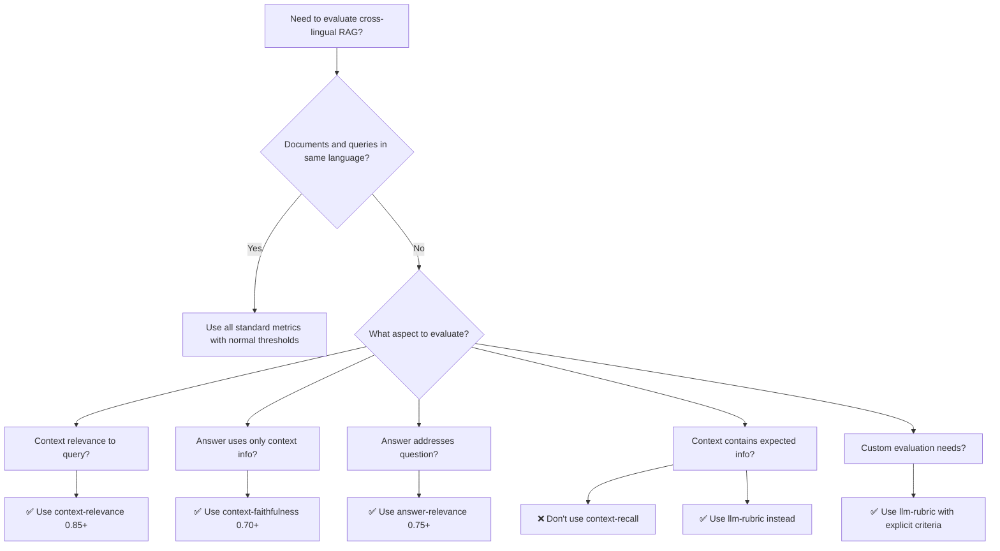

# Which RAG Metrics Actually Work for Cross-Lingual Evaluation?

## Executive Summary

Not all RAG metrics are suitable for cross-lingual scenarios. Some work excellently, others need modification, and some should be avoided entirely. This guide helps you choose the right metrics for your multi-lingual RAG system.

## Metric Suitability Matrix

| Metric                   | Cross-Lingual Suitability | Why                                                           | Alternative Approach                                  |
| ------------------------ | ------------------------- | ------------------------------------------------------------- | ----------------------------------------------------- |
| **context-relevance**    | ✅ EXCELLENT               | Measures relevance conceptually, language-agnostic            | Use as-is with high thresholds (0.85+)                |
| **context-faithfulness** | ✅ GOOD                    | LLMs understand information sourcing across languages         | Use with slight threshold reduction (0.70-0.80)       |
| **answer-relevance**     | ✅ GOOD                    | LLMs can assess if answer addresses question across languages | Use with slight threshold reduction (0.75-0.85)       |
| **context-recall**       | ❌ POOR                    | Relies on matching expected text against context              | Use alternative metrics or translation                |
| **factuality**           | ⚠️ MODERATE                | Works if ground truth is language-independent                 | Translate ground truth or use language-specific facts |
| **llm-rubric**           | ✅ EXCELLENT               | Can specify cross-lingual criteria explicitly                 | Best option for custom cross-lingual evaluation       |

## Understanding Why Metrics Succeed or Fail

### Metrics That Work Well Cross-Lingually

#### 1. Context-Relevance (Best Performer)
**What it measures**: What fraction of the context is relevant to answering the query

**Why it works cross-lingually**: 
- Relevance is a conceptual relationship, not linguistic
- LLMs understand semantic connections across languages
- Doesn't rely on exact text matching

**How to use**:
```yaml
assert:
  - type: context-relevance
    threshold: 0.85  # Keep high even for cross-lingual
```

**Real example**: Query in English about "climate change" with Spanish context about "cambio climático" - the metric correctly identifies relevant passages.

#### 2. Context-Faithfulness (Good Performer)
**What it measures**: Whether the answer only uses information from the provided context

**Why it works cross-lingually**:
- LLMs can trace information sources across languages
- Conceptual grounding transcends language barriers
- Modern models understand paraphrasing and translation

**How to use**:
```yaml
assert:
  - type: context-faithfulness
    threshold: 0.75  # Slightly lower for cross-lingual, but still meaningful
```

#### 3. Answer-Relevance (Good Performer)
**What it measures**: How directly the answer addresses the question

**Why it works cross-lingually**:
- Question-answer alignment is conceptual
- LLMs understand intent across languages
- Doesn't require exact matching

**How to use**:
```yaml
assert:
  - type: answer-relevance
    threshold: 0.80  # Works well even cross-lingually
```

### Metrics That Don't Work Cross-Lingually

#### 1. Context-Recall (Avoid for Cross-Lingual)
**What it measures**: Whether context contains information needed for the expected answer

**Why it fails cross-lingually**:
- Attempts to match expected answer text against context in different language
- Relies on near-exact matching that fails across languages
- Semantic equivalence != textual similarity across languages

**DON'T do this**:
```yaml
# ❌ BAD: Setting ultra-low threshold makes metric meaningless
assert:
  - type: context-recall
    value: "Expected answer in Language A"  # Context is in Language B
    threshold: 0.15  # This is essentially random
```

**DO this instead**:
```yaml
# ✅ GOOD: Use language-appropriate expected answers or different metrics
assert:
  - type: llm-rubric
    value: "Check if context contains information about X, Y, and Z concepts"
```

#### 2. Factuality (Limited Use)
**What it measures**: Whether output matches ground truth facts

**Why it struggles cross-lingually**:
- Ground truth in one language may not match output in another
- Translation introduces variations
- Cultural/regional differences in expressing facts

**Better approach**: Use language-independent facts or translate ground truth

### Metrics That Need Modification

#### String-Based Metrics (contains, regex, etc.)
These obviously fail cross-lingually unless you:
1. Translate first
2. Use language-specific patterns
3. Look for universal elements (numbers, codes, names)

## Recommended Metric Strategies for Cross-Lingual RAG

### Strategy 1: Use Conceptual Metrics Only

For true cross-lingual evaluation, stick to metrics that evaluate concepts rather than text:

```yaml
# Good cross-lingual configuration
defaultTest:
  assert:
    - type: context-relevance
      threshold: 0.85
    - type: context-faithfulness  
      threshold: 0.75
    - type: answer-relevance
      threshold: 0.80
    - type: llm-rubric
      value: "Does the answer address all key points from the query?"
```

### Strategy 2: Custom LLM-Rubric for Cross-Lingual

The `llm-rubric` metric is your best friend for cross-lingual evaluation:

```yaml
assert:
  - type: llm-rubric
    value: |
      Evaluate if the answer (in {{answer_language}}):
      1. Correctly uses information from the context (in {{context_language}})
      2. Addresses all aspects of the query (in {{query_language}})
      3. Maintains factual accuracy across language translation
      Score 1 if all criteria are met, 0 otherwise.
```

### Strategy 3: Language-Specific Expected Outputs

Instead of using cross-lingual context-recall, provide expected answers in the appropriate language:

```yaml
tests:
  - vars:
      query: "What causes climate change?"
      context: "El cambio climático es causado por emisiones de gases..."
      # Expected answer in same language as output
      expected_answer_english: "Climate change is caused by greenhouse gas emissions"
      expected_answer_spanish: "El cambio climático es causado por emisiones de gases"
    assert:
      - type: llm-rubric
        value: "Check if answer covers: {{expected_answer_english}}"
```

### Strategy 4: Translation Layer

For metrics that don't work cross-lingually, add translation:

```python
def evaluate_with_translation(query, context, output):
    # Translate all to common language first
    context_en = translate_to_english(context)
    output_en = translate_to_english(output)
    
    # Now use standard metrics
    return evaluate_metrics(query, context_en, output_en)
```

## Practical Decision Tree



## Common Pitfalls and Solutions

### Pitfall 1: Using Context-Recall Cross-Lingually
**Problem**: Context-recall drops from 80% to 20% cross-lingually
**Wrong solution**: Lower threshold to 0.20
**Right solution**: Don't use context-recall for cross-lingual evaluation

### Pitfall 2: Expecting Exact Matches Across Languages
**Problem**: Looking for specific phrases that don't translate literally
**Wrong solution**: Complex regex patterns
**Right solution**: Use conceptual evaluation with llm-rubric

### Pitfall 3: Ignoring Language-Specific Nuances
**Problem**: "Yes" vs "Sí" vs "はい" aren't recognized as equivalent
**Wrong solution**: Multiple string matches
**Right solution**: Use answer-relevance or llm-rubric

### Pitfall 4: Over-Relying on Poor Performing Metrics
**Problem**: Keeping metrics that don't work just with lower thresholds
**Wrong solution**: threshold: 0.10 (essentially random)
**Right solution**: Remove the metric or replace with suitable alternative

## Recommended Configurations

### For Production Cross-Lingual Systems

```yaml
# ONLY use metrics that actually work cross-lingually
description: Production cross-lingual RAG evaluation

defaultTest:
  assert:
    # These work well cross-lingually
    - type: context-relevance
      threshold: 0.85
    - type: context-faithfulness
      threshold: 0.75
    - type: answer-relevance
      threshold: 0.80
    
    # DON'T use these for cross-lingual
    # - type: context-recall  # ❌ Avoid
    # - type: factuality      # ❌ Unless carefully configured
    
    # Use custom rubrics for specific checks
    - type: llm-rubric
      value: |
        Evaluate the response for:
        1. Accurate use of source information regardless of language
        2. Complete answer to the query
        3. No hallucinated information
        Rate 0-1 based on these criteria.
```

### For Monolingual with Occasional Cross-Lingual

```yaml
# Dynamically adjust based on language match
assert:
  - type: context-faithfulness
    threshold: 0.85  # Always works
  
  - type: context-relevance
    threshold: 0.90  # Always works
  
  # Only use context-recall when languages match
  {{#if (eq query_language context_language)}}
  - type: context-recall
    value: "{{expected_answer}}"
    threshold: 0.75
  {{else}}
  # Use rubric for cross-lingual cases
  - type: llm-rubric
    value: "Verify context contains key information about: {{key_concepts}}"
  {{/if}}
```

## Key Takeaways

1. **Not all metrics are created equal for cross-lingual evaluation**
   - Use: context-relevance, context-faithfulness, answer-relevance, llm-rubric
   - Avoid: context-recall, basic factuality, string matching

2. **"Lowering thresholds" is not the answer**
   - If a metric drops from 80% to 20%, it's not working
   - Use different metrics instead

3. **LLM-rubric is your Swiss Army knife**
   - Most flexible for cross-lingual evaluation
   - Can encode complex cross-lingual criteria
   - Explicit about what you're measuring

4. **Conceptual evaluation > Textual matching**
   - Focus on semantic meaning, not literal text
   - Evaluate relationships and concepts
   - Let LLMs handle the language bridge

5. **Test your metrics first**
   - Run baseline tests to see which metrics work for your language pairs
   - Don't assume all metrics will work
   - Be prepared to use different metrics for different language pairs

## Conclusion

For cross-lingual RAG evaluation, be selective about your metrics. Use those that evaluate conceptual relationships (context-relevance, context-faithfulness, answer-relevance) and avoid those that rely on textual matching (context-recall). When in doubt, use llm-rubric with explicit cross-lingual criteria. 

Remember: A metric that drops from 80% to 20% effectiveness isn't telling you to lower your standards - it's telling you to use a different tool.
