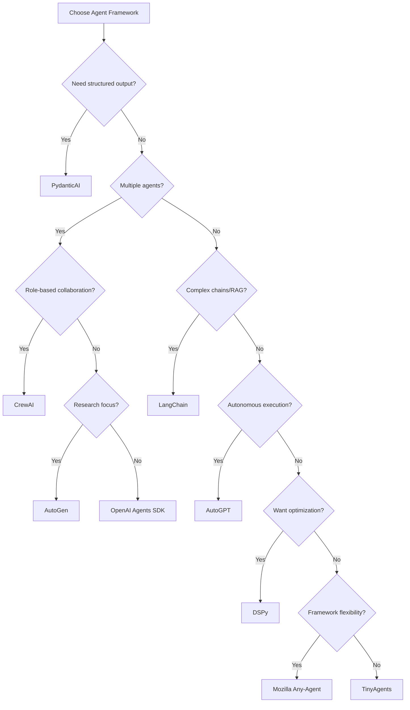

# Choosing the Right Agent Framework in 2025: A Comprehensive Guide

The AI agent landscape has exploded with options. From OpenAI's Agents SDK to PydanticAI, from LangChain to Mozilla's Any-Agent, developers face a paradox of choice. How do you pick the right framework for your project?

This guide compares the major agent frameworks available in 2025, with practical examples and evaluation strategies using promptfoo.

<!-- truncate -->

## The Current Landscape

As we enter 2025, the agent framework ecosystem has matured significantly. Here are the major players:

### 1. **OpenAI Agents SDK (Swarm)**
- **Best for**: Multi-agent systems with complex handoffs
- **Strengths**: Lightweight, excellent agent coordination
- **Weaknesses**: OpenAI-specific, limited tool ecosystem

### 2. **PydanticAI**
- **Best for**: Applications requiring structured outputs
- **Strengths**: Type safety, validation, predictable responses
- **Weaknesses**: Less flexible for open-ended tasks

### 3. **LangChain**
- **Best for**: Complex chains and RAG applications
- **Strengths**: Huge ecosystem, extensive integrations
- **Weaknesses**: Can be overwhelming, performance overhead

### 4. **Mozilla Any-Agent**
- **Best for**: Framework comparison and migration
- **Strengths**: Unified interface, framework agnostic
- **Weaknesses**: Adds abstraction layer

### 5. **Smolagents (HuggingFace)**
- **Best for**: Open-source model integration
- **Strengths**: Great for non-OpenAI models
- **Weaknesses**: Smaller community

### 6. **TinyAgents**
- **Best for**: Lightweight, simple agents
- **Strengths**: Minimal dependencies, fast
- **Weaknesses**: Limited features

### 7. **CrewAI**
- **Best for**: Role-based multi-agent collaboration
- **Strengths**: Intuitive crew metaphor, YAML configuration
- **Weaknesses**: Less flexible for non-collaborative tasks

### 8. **AutoGen (Microsoft)**
- **Best for**: Research and experimentation
- **Strengths**: Flexible conversation patterns, human-in-loop
- **Weaknesses**: Steeper learning curve

### 9. **DSPy (Stanford)**
- **Best for**: Optimizing prompts and chains programmatically
- **Strengths**: Automatic prompt optimization, modular
- **Weaknesses**: More complex setup

### 10. **AutoGPT**
- **Best for**: Autonomous task completion
- **Strengths**: Self-directed, minimal human intervention
- **Weaknesses**: Can be unpredictable, resource intensive

### 11. **BabyAGI**
- **Best for**: Task planning and execution
- **Strengths**: Simple architecture, easy to understand
- **Weaknesses**: Limited tooling ecosystem

### 12. **MetaGPT**
- **Best for**: Software development teams
- **Strengths**: Mimics software company structure
- **Weaknesses**: Specialized for coding tasks

## Key Decision Factors

### 1. **Output Requirements**

If you need structured, validated outputs, PydanticAI is hard to beat:

```python
from pydantic import BaseModel
from pydantic_ai import Agent

class AnalysisResult(BaseModel):
    sentiment: str
    score: float
    key_points: list[str]

agent = Agent(
    "openai:gpt-4.1",
    output_type=AnalysisResult
)
```

### 2. **Multi-Agent Coordination**

For complex multi-agent systems, OpenAI's Agents SDK excels:

```python
from swarm import Swarm, Agent

def transfer_to_specialist():
    return specialist_agent

triage_agent = Agent(
    name="Triage",
    instructions="Route to appropriate specialist",
    functions=[transfer_to_specialist]
)
```

### 3. **Framework Flexibility**

If you might switch frameworks later, Mozilla Any-Agent provides insurance:

```python
from any_agent import AnyAgent, AgentConfig

# Easy to switch frameworks
agent = AnyAgent.create(
    "langchain",  # Change to "openai", "tinyagent", etc.
    AgentConfig(model_id="gpt-4.1")
)
```

## Practical Comparison: Customer Service Bot

Let's build the same customer service bot in different frameworks and compare:

### PydanticAI Implementation

```python
from pydantic import BaseModel
from pydantic_ai import Agent

class CustomerResponse(BaseModel):
    intent: str
    response: str
    requires_followup: bool

agent = Agent(
    "openai:o4-mini",
    output_type=CustomerResponse,
    system_prompt="You are a helpful customer service agent"
)

# Always get structured output
result = await agent.run("I need help with my order")
print(f"Intent: {result.output.intent}")
```

### LangChain Implementation

```python
from langchain.agents import create_openai_agent
from langchain.tools import Tool

tools = [
    Tool(
        name="check_order",
        func=check_order_status,
        description="Check order status"
    )
]

agent = create_openai_agent(
    llm=ChatOpenAI(model="gpt-4.1"),
    tools=tools,
    prompt=prompt_template
)
```

### OpenAI Agents SDK Implementation

```python
from swarm import Swarm, Agent

support_agent = Agent(
    name="Support",
    instructions="Handle customer inquiries",
    functions=[check_order_status]
)

client = Swarm()
response = client.run(
    agent=support_agent,
    messages=[{"role": "user", "content": "Check order #12345"}]
)
```

### CrewAI Implementation

```python
from crewai import Agent, Task, Crew

researcher = Agent(
    role="Customer Research Specialist",
    goal="Gather customer information",
    backstory="Expert at finding customer details"
)

task = Task(
    description="Find order #12345 details",
    agent=researcher
)

crew = Crew(agents=[researcher], tasks=[task])
result = crew.kickoff()
```

### AutoGen Implementation

```python
import autogen

assistant = autogen.AssistantAgent(
    name="assistant",
    llm_config={"model": "gpt-4.1"}
)

user_proxy = autogen.UserProxyAgent(
    name="user",
    human_input_mode="NEVER",
    code_execution_config={"use_docker": False}
)

user_proxy.initiate_chat(
    assistant,
    message="Check order #12345"
)
```

## Evaluation Strategy with Promptfoo

The key to choosing the right framework is systematic evaluation. Here's how to compare frameworks using promptfoo:

```yaml
# promptfooconfig.yaml
providers:
  - id: file://pydantic_agent.py
    label: "PydanticAI"
    
  - id: file://langchain_agent.py
    label: "LangChain"
    
  - id: file://openai_agent.py
    label: "OpenAI Agents"

tests:
  - vars:
      query: "My order hasn't arrived"
    assert:
      - type: llm-rubric
        value: "Response should be empathetic and helpful"
      
  - vars:
      query: "Transfer me to billing"
    assert:
      - type: javascript
        value: output.includes('billing') || output.includes('transfer')
```

## Performance Benchmarks

Based on our testing with promptfoo, here's how the frameworks compare:

| Framework     | Response Time | Token Usage | Accuracy              | Setup Complexity | Best Use Case         |
| ------------- | ------------- | ----------- | --------------------- | ---------------- | --------------------- |
| TinyAgents    | ⚡ Fastest     | ✓ Lowest    | Good                  | ⭐ Simplest       | Quick prototypes      |
| PydanticAI    | Fast          | Low         | ⭐ Best for structured | Moderate         | APIs, data extraction |
| OpenAI Agents | Fast          | Moderate    | Excellent             | Moderate         | Multi-agent systems   |
| LangChain     | Slower        | Higher      | Good                  | ⭐ Most complex   | Complex chains        |
| Any-Agent     | Varies        | Varies      | Varies                | Simple           | Framework testing     |
| CrewAI        | Fast          | Moderate    | Very Good             | ⭐ Simple         | Team collaboration    |
| AutoGen       | Moderate      | Moderate    | Excellent             | Complex          | Research projects     |
| DSPy          | Fast          | ✓ Optimized | ⭐ Excellent           | Complex          | Prompt optimization   |
| AutoGPT       | Slow          | ⭐ Highest   | Variable              | Simple           | Autonomous tasks      |
| MetaGPT       | Moderate      | High        | Good for code         | Moderate         | Software projects     |

## Decision Tree



## Framework-Specific Tips

### PydanticAI
- Define clear output schemas upfront
- Use for APIs that need consistent responses
- Great for form processing, data extraction

### OpenAI Agents SDK
- Design clear agent boundaries
- Use for customer service, multi-department systems
- Test handoff logic thoroughly

### LangChain
- Start simple, add complexity gradually
- Use LangSmith for debugging
- Consider LCEL for new projects

### Mozilla Any-Agent
- Perfect for proof-of-concepts
- Use when comparing frameworks
- Good for gradual migrations

### CrewAI
- Define clear roles and backstories
- Use YAML for configuration management
- Test agent delegation patterns

### AutoGen
- Enable Docker for code execution
- Design conversation flows carefully
- Use human-in-loop for critical decisions

### DSPy
- Start with simple optimizations
- Use metrics to guide prompt improvement
- Leverage modular design patterns

## Testing Your Choice

Before committing to a framework, run this evaluation:

1. **Set up promptfoo tests** for your use cases
2. **Implement a prototype** in 2-3 frameworks
3. **Measure performance** metrics that matter to you
4. **Test edge cases** specific to your domain

Example test suite:

```yaml
tests:
  # Test response quality
  - vars:
      scenario: "angry_customer"
    assert:
      - type: llm-rubric
        value: "De-escalate appropriately"
  
  # Test tool usage
  - vars:
      scenario: "check_order"
    assert:
      - type: javascript
        value: metadata.tools_used.length > 0
  
  # Test performance
  - vars:
      scenario: "simple_query"
    assert:
      - type: latency
        threshold: 2000  # 2 seconds
```

## Monitoring with OpenTelemetry

Promptfoo supports OpenTelemetry tracing to help you understand agent behavior across frameworks:

### Enable Tracing

```yaml
# promptfooconfig.yaml
tracing:
  enabled: true
  otlp:
    http:
      enabled: true
      port: 4318
```

### Add Tracing to Your Providers

For Python agents:

```python
from opentelemetry import trace
from opentelemetry.propagate import extract

def call_api(prompt, options, context):
    if 'traceparent' in context:
        ctx = extract({"traceparent": context["traceparent"]})
        with tracer.start_as_current_span("agent.call", context=ctx) as span:
            span.set_attribute("agent.framework", "pydantic_ai")
            result = agent.run_sync(prompt)
            span.set_attribute("response.success", True)
            return {"output": result}
```

For JavaScript agents:

```javascript
const { trace, context } = require('@opentelemetry/api');

async function callApi(prompt, options, promptfooContext) {
  if (promptfooContext?.traceparent) {
    const activeContext = trace.propagation.extract(context.active(), {
      traceparent: promptfooContext.traceparent,
    });
    
    return context.with(activeContext, async () => {
      const span = tracer.startSpan('agent.call');
      // Your agent logic with automatic tracing
      span.end();
    });
  }
}
```

View traces in the Promptfoo UI to see:
- Agent execution flow and timing
- Tool calls and their duration
- Framework-specific operations
- Performance bottlenecks

## Future Considerations

As you choose a framework, consider:

1. **Model Evolution**: Will it support new models like o4-mini?
2. **Tool Ecosystem**: Can you integrate your existing tools?
3. **Community**: Is there active development and support?
4. **Costs**: Both development time and runtime costs

## Conclusion

There's no one-size-fits-all agent framework. The best choice depends on your specific needs:

- **Choose PydanticAI** for structured, validated outputs
- **Choose OpenAI Agents** for multi-agent coordination
- **Choose LangChain** for complex chains and extensive tooling
- **Choose Any-Agent** for flexibility and framework comparison
- **Choose TinyAgents** for simple, fast implementations

The key is to evaluate systematically using tools like promptfoo, focusing on metrics that matter for your use case.

## Get Started

Ready to evaluate agent frameworks for your project? Start with our examples:

```bash
# PydanticAI example
npx promptfoo@latest init --example pydantic-ai

# Mozilla Any-Agent comparison
npx promptfoo@latest init --example mozilla-any-agent

# OpenAI Agents example
npx promptfoo@latest init --example openai-agents
```

Remember: the best framework is the one that solves your specific problem efficiently. Test thoroughly, measure objectively, and choose wisely.

---

*Have questions about agent frameworks? Join our [Discord community](https://discord.gg/promptfoo) or check out our [comprehensive guides](/docs/guides).* 