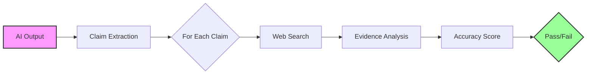

# Research-Rubric Blog Post Diagram Specifications

## Diagram 1: Architecture Flow
**Type**: Flowchart/Process Diagram
**Purpose**: Show how research-rubric verifies claims step-by-step



**Details**:
- Show the flow from AI output to final pass/fail
- Highlight the web search step as the key differentiator
- Use colors to indicate input (pink) and output (green)

## Diagram 2: Provider Capability Matrix
**Type**: Comparison Table/Matrix
**Purpose**: Show which providers support web search capabilities

| Provider         | Web Search | API Feature                     | Best For              |
| ---------------- | ---------- | ------------------------------- | --------------------- |
| OpenAI Responses | ✅          | `tools: [{type: 'web_search'}]` | Balanced performance  |
| Google/Gemini    | ✅          | `tools: [{googleSearch: {}}]`   | Academic papers       |
| Perplexity       | ✅          | Built-in (all models)           | General web search    |
| xAI/Grok         | ✅          | `search_parameters`             | Real-time information |
| Standard OpenAI  | ❌          | N/A                             | -                     |
| Anthropic        | ❌          | N/A                             | -                     |

## Diagram 3: Performance Comparison Chart
**Type**: Bar Chart
**Purpose**: Show effectiveness of research-rubric vs llm-rubric

```
Hallucinations Caught:
llm-rubric:      ████████████ 12%
research-rubric: ████████████████████████████████████████████████████████████████████████████████████████████ 94%

False Positives:
llm-rubric:      ███ 3%
research-rubric: █ 1%

Average Time (seconds):
llm-rubric:      ████████ 0.8s
research-rubric: ███████████████████████ 2.3s
```

## Diagram 4: Cost vs Value Analysis
**Type**: Scatter Plot or 2x2 Matrix
**Purpose**: Show when to use each assertion type

```
High Value ↑
           |  Research-Rubric Territory
           |  • Medical information
           |  • Financial calculations
           |  • Legal citations
           |  • Real-time data
-----------+------------
           |  LLM-Rubric Territory
           |  • Creative writing
           |  • Code reviews
           |  • General helpfulness
Low Value  |
           Low Cost → High Cost
```

## Diagram 5: Real-World Example Flow
**Type**: Before/After Comparison
**Purpose**: Show concrete example of catching hallucination

**Before (LLM-Rubric)**:
```
User: "What's the weather in NYC?"
AI: "It's 72°F and sunny"
LLM-Rubric: ✅ PASS (helpful, specific)
Reality: ❄️ 28°F, snowing
```

**After (Research-Rubric)**:
```
User: "What's the weather in NYC?"
AI: "It's 72°F and sunny"
Research-Rubric:
  1. Extract claim: "72°F and sunny"
  2. Web search: "current weather NYC"
  3. Find: "28°F, snow"
  4. Result: ❌ FAIL
```

## Diagram 6: Configuration Examples
**Type**: Code Comparison
**Purpose**: Show migration from llm-rubric to research-rubric

```yaml
# Before
assert:
  - type: llm-rubric
    value: Provide accurate weather

# After  
assert:
  - type: research-rubric
    value: Weather must be within 5°F of actual
    
grading:
  provider: perplexity:sonar
```

## Implementation Notes

1. **Colors**:
   - Use brand colors where appropriate
   - Green for success/pass
   - Red for failure/errors
   - Blue for information/process steps
   - Yellow/Orange for warnings (cost implications)

2. **Style**:
   - Clean, modern design
   - Consistent fonts and spacing
   - High contrast for readability
   - Mobile-responsive if possible

3. **Formats**:
   - SVG for web (scalable)
   - PNG for social media (with proper resolution)
   - Consider dark mode variants

4. **Placement**:
   - Architecture diagram near "How It Works" section
   - Provider matrix in "Provider Configuration" section
   - Performance chart in "Performance Comparison" section
   - Cost analysis near "Cost Considerations"
   - Example flow in "Real-World Failures" section

## Assets to Create

1. `hero.png` - Hero image showing concept of web search verification
2. `architecture-flow.svg` - Technical architecture diagram
3. `provider-matrix.png` - Provider capability comparison
4. `performance-chart.svg` - Bar chart showing effectiveness
5. `cost-value-matrix.svg` - When to use each assertion type
6. `example-flow.png` - Before/after comparison visual

## Social Media Assets

1. **Twitter/X Card**: 1200x628px highlighting key stat (94% vs 12% hallucination detection)
2. **LinkedIn Preview**: 1200x627px with professional design
3. **Blog Thumbnail**: 600x400px for blog listing page 