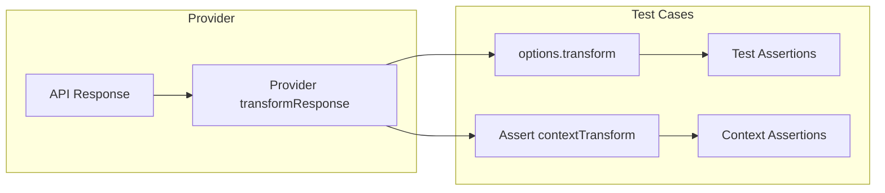

# Reference

Here is the main structure of the promptfoo configuration file:

### Config

| Property                        | Type                                                                                                                                                  | Required                       | Description                                                                                                                                                                                                                     |
| ------------------------------- | ----------------------------------------------------------------------------------------------------------------------------------------------------- | ------------------------------ | ------------------------------------------------------------------------------------------------------------------------------------------------------------------------------------------------------------------------------- |
| description                     | string                                                                                                                                                | No                             | Optional description of what your LLM is trying to do                                                                                                                                                                           |
| tags                            | Record\<string, string\>                                                                                                                              | No                             | Optional tags to describe the test suite (e.g. `env: production`, `application: chatbot`)                                                                                                                                       |
| providers                       | [ProvidersConfig](#providersconfig)                                                                                                                   | Yes, unless `targets` is set   | One or more [LLM APIs](/docs/providers) to use. Exactly one of `providers` or `targets` must be set.                                                                                                                            |
| targets                         | [ProvidersConfig](#providersconfig)                                                                                                                   | Yes, unless `providers` is set | Alias for `providers`, commonly used in [red team](/docs/red-team) configs. Exactly one of `targets` or `providers` must be set.                                                                                                |
| prompts                         | string \| string[] \| Record\<string, string\> \| Prompt[]                                                                                            | Yes                            | One or more [prompts](/docs/configuration/prompts) to load                                                                                                                                                                      |
| tests                           | string \| (string \| [Test Case](#test-case) \| [Test Generator Config](#test-generator-config))[] \| [Test Generator Config](#test-generator-config) | No                             | Path to a [test file](/docs/configuration/test-cases), inline tests, or a generator. If omitted, promptfoo runs each prompt/provider pair once with empty vars.                                                                 |
| scenarios                       | (string \| [Scenario](#scenario))[]                                                                                                                   | No                             | [Scenario](/docs/configuration/scenarios) files or inline scenario definitions                                                                                                                                                  |
| defaultTest                     | `file://${string}` \| Partial [Test Case](#test-case)                                                                                                 | No                             | Sets the [default properties](/docs/configuration/guide#default-test-cases) for each test case. Can be an inline object or a `file://` path to an external YAML/JSON file.                                                      |
| outputPath                      | string \| string[]                                                                                                                                    | No                             | Where to write output. Writes to console/web viewer if not set. See [output formats](/docs/configuration/outputs).                                                                                                              |
| sharing                         | boolean \| object                                                                                                                                     | No                             | Enables or configures [result sharing](/docs/usage/sharing) with optional `apiBaseUrl` and `appBaseUrl` fields                                                                                                                  |
| nunjucksFilters                 | Record\<string, string\>                                                                                                                              | No                             | Map of [Nunjucks](https://mozilla.github.io/nunjucks/) filter names to file paths                                                                                                                                               |
| env                             | Record\<string, string \| number \| boolean\>                                                                                                         | No                             | Environment variables to set for the test run. These values will override existing environment variables. Can be used to set API keys and other configuration values needed by providers.                                       |
| derivedMetrics                  | [DerivedMetric](#derivedmetric)[]                                                                                                                     | No                             | Metrics calculated after the eval from named assertion scores                                                                                                                                                                   |
| extensions                      | string[] \| null                                                                                                                                      | No                             | List of [extension files](#extension-hooks) to load. Each extension is a file path with a function name. Can be Python (.py) or JavaScript (.js) files. Supported hooks are 'beforeAll', 'afterAll', 'beforeEach', 'afterEach'. |
| metadata                        | Record\<string, any\>                                                                                                                                 | No                             | Arbitrary metadata stored with the eval config                                                                                                                                                                                  |
| redteam                         | RedteamConfig                                                                                                                                         | No                             | [Red team](/docs/red-team/configuration) configuration                                                                                                                                                                          |
| writeLatestResults              | boolean                                                                                                                                               | No                             | Write latest results to promptfoo storage so they can be viewed in the web UI                                                                                                                                                   |
| tracing                         | TracingConfig                                                                                                                                         | No                             | [OpenTelemetry tracing](/docs/tracing) configuration                                                                                                                                                                            |
| evaluateOptions.maxConcurrency  | number                                                                                                                                                | No                             | Maximum number of concurrent requests. Defaults to 4                                                                                                                                                                            |
| evaluateOptions.repeat          | number                                                                                                                                                | No                             | Number of times to run each test case. Defaults to 1                                                                                                                                                                            |
| evaluateOptions.delay           | number                                                                                                                                                | No                             | Force the test runner to wait after each API call (milliseconds). Defaults to 0                                                                                                                                                 |
| evaluateOptions.showProgressBar | boolean                                                                                                                                               | No                             | Whether to display the progress bar                                                                                                                                                                                             |
| evaluateOptions.cache           | boolean                                                                                                                                               | No                             | Whether to use disk [cache](/docs/configuration/caching) for results (default: true)                                                                                                                                            |
| evaluateOptions.timeoutMs       | number                                                                                                                                                | No                             | Timeout in milliseconds for each individual test case/provider API call. When reached, that specific test is marked as an error. Default is 0 (no timeout).                                                                     |
| evaluateOptions.maxEvalTimeMs   | number                                                                                                                                                | No                             | Maximum total runtime in milliseconds for the entire evaluation process. When reached, all remaining tests are marked as errors and the evaluation ends. Default is 0 (no limit).                                               |
| commandLineOptions              | [CommandLineOptions](#commandlineoptions)                                                                                                             | No                             | Default values for command-line options. These values will be used unless overridden by actual command-line arguments.                                                                                                          |

### Test Case

A test case represents a single example input that is fed into all prompts and providers.

| Property                       | Type                                                              | Required | Description                                                                                                                                                                                                                     |
| ------------------------------ | ----------------------------------------------------------------- | -------- | ------------------------------------------------------------------------------------------------------------------------------------------------------------------------------------------------------------------------------- |
| description                    | string                                                            | No       | Description of what you're testing                                                                                                                                                                                              |
| vars                           | Record\<string, [VarValue](#varvalue)\> \| string \| string[]     | No       | Key-value pairs to substitute in the prompt. If `vars` is a string or string array, promptfoo loads test vars from those file paths. See [Test Case Configuration](/docs/configuration/test-cases) for loading vars from files. |
| provider                       | string \| ProviderOptions \| ApiProvider                          | No       | Override the default [provider](/docs/providers) for this specific test case                                                                                                                                                    |
| providers                      | string[]                                                          | No       | Filter which providers this test runs against. Supports labels, IDs, and wildcards (e.g., `openai:*`). See [filtering tests by provider](/docs/configuration/test-cases#filtering-tests-by-provider).                           |
| prompts                        | string[]                                                          | No       | Filter this test to run only with specific prompts (by label or ID). Supports wildcards like `Math:*`. See [Filtering Tests by Prompt](/docs/configuration/test-cases#filtering-tests-by-prompt).                               |
| providerOutput                 | string \| Record\<string, unknown\>                               | No       | Precomputed provider output. When set, promptfoo skips calling the provider and runs assertions directly against this output.                                                                                                   |
| assert                         | ([Assertion](#assertion) \| [Assertion Set](#assertion-set))[]    | No       | List of automatic checks to run on the LLM output. See [assertions & metrics](/docs/configuration/expected-outputs) for all available types.                                                                                    |
| assertScoringFunction          | `file://` JavaScript/Python path \| function                      | No       | Custom scoring function that combines named assertion scores into the final grading result.                                                                                                                                     |
| threshold                      | number                                                            | No       | Test will fail if the combined score of assertions is less than this number                                                                                                                                                     |
| metadata                       | Record\<string, any\>                                             | No       | Additional metadata to include with the test case, useful for [filtering](/docs/configuration/test-cases#metadata-in-csv) or grouping results                                                                                   |
| options                        | Object                                                            | No       | Additional configuration settings for the test case                                                                                                                                                                             |
| options.transformVars          | string \| function                                                | No       | A filepath (js or py), JavaScript snippet, or Node.js function that runs on the vars before they are substituted into the prompt. See [transforming input variables](/docs/configuration/guide#transforming-input-variables).   |
| options.transform              | string \| function                                                | No       | A filepath (js or py), JavaScript snippet, or Node.js function that runs on LLM output before assertions. See [transforming outputs](/docs/configuration/guide#transforming-outputs).                                           |
| options.postprocess            | string \| function                                                | No       | Deprecated alias for `options.transform`                                                                                                                                                                                        |
| options.prefix                 | string                                                            | No       | Text to prepend to the prompt                                                                                                                                                                                                   |
| options.suffix                 | string                                                            | No       | Text to append to the prompt                                                                                                                                                                                                    |
| options.provider               | string \| ProviderOptions \| ApiProvider \| Record\<string, any\> | No       | The API provider to use for [model-graded](/docs/configuration/expected-outputs/model-graded) assertion grading                                                                                                                 |
| options.rubricPrompt           | string \| string[] \| ChatMessage[]                               | No       | Custom prompt for [model-graded](/docs/configuration/expected-outputs/model-graded) assertions                                                                                                                                  |
| options.factuality             | object                                                            | No       | Score weights for factuality assertions (`subset`, `superset`, `agree`, `disagree`, `differButFactual`)                                                                                                                         |
| options.disableVarExpansion    | boolean                                                           | No       | If true, arrays in `vars` are not expanded into multiple test cases                                                                                                                                                             |
| options.disableConversationVar | boolean                                                           | No       | If true, promptfoo does not include the implicit `_conversation` variable in the prompt                                                                                                                                         |
| options.disableDefaultAsserts  | boolean                                                           | No       | If true, this test case does not inherit assertions from `defaultTest.assert`; other `defaultTest` properties still apply                                                                                                       |
| options.runSerially            | boolean                                                           | No       | If true, run this test case without concurrency regardless of global settings                                                                                                                                                   |
| options.storeOutputAs          | string                                                            | No       | The output of this test will be stored as a variable, which can be used in subsequent tests. See [multi-turn conversations](/docs/configuration/chat#using-storeoutputas).                                                      |
| options.\<provider-specific\>  | any                                                               | No       | Provider-specific config fields (e.g., `response_format`, `responseSchema`) are passed through to the provider. Use `file://` to load from external files. See [Per-test provider config](#per-test-provider-config).           |

### Test Generator Config

Use a test generator config when `tests` should be produced by a JavaScript or Python generator.

| Property | Type                  | Required | Description                                                                  |
| -------- | --------------------- | -------- | ---------------------------------------------------------------------------- |
| path     | string                | Yes      | Path to the generator function, e.g. `file://path/to/tests.py:function_name` |
| config   | Record\<string, any\> | No       | Configuration passed to the generator. Values may reference `file://` paths. |

#### Per-test provider config {#per-test-provider-config}

Test-level `options` can include provider-specific configuration fields that override the provider's default config for that specific test. This is useful for:

- Using different structured output schemas per test
- Varying temperature or other parameters for specific test cases
- Testing the same prompt with different model configurations

```yaml
tests:
  - vars:
      question: 'What is 2 + 2?'
    options:
      # Provider-specific: loaded from external file
      response_format: file://./schemas/math-response.json
      # Provider-specific: inline override
      temperature: 0
```

The external file must contain the complete configuration object. For OpenAI structured outputs:

```json title="schemas/math-response.json"
{
  "type": "json_schema",
  "json_schema": {
    "name": "math_response",
    "strict": true,
    "schema": {
      "type": "object",
      "properties": {
        "answer": { "type": "number" },
        "explanation": { "type": "string" }
      },
      "required": ["answer", "explanation"],
      "additionalProperties": false
    }
  }
}
```

See the [OpenAI structured outputs guide](/docs/providers/openai#using-response_format) for more details.

### Assertion

More details on using assertions, including examples [here](/docs/configuration/expected-outputs).

| Property         | Type                                                              | Required | Description                                                                                                                                                                                                                                                                                                          |
| ---------------- | ----------------------------------------------------------------- | -------- | -------------------------------------------------------------------------------------------------------------------------------------------------------------------------------------------------------------------------------------------------------------------------------------------------------------------- |
| type             | string                                                            | Yes      | Type of assertion. See [assertion types](/docs/configuration/expected-outputs#assertion-types) for all available types. `not-` prefixes are supported for most base assertion types.                                                                                                                                 |
| value            | string \| string[] \| number \| object \| function                | No       | The expected value, if applicable                                                                                                                                                                                                                                                                                    |
| config           | Record\<string, any\>                                             | No       | Extra configuration passed to the assertion or assertion value function                                                                                                                                                                                                                                              |
| threshold        | number                                                            | No       | The threshold value, applicable only to certain types such as [`similar`](/docs/configuration/expected-outputs/similar), [`cost`](/docs/configuration/expected-outputs/deterministic#cost), [`javascript`](/docs/configuration/expected-outputs/javascript), [`python`](/docs/configuration/expected-outputs/python) |
| weight           | number                                                            | No       | Weight of this assertion compared to other assertions in the test case. Defaults to 1                                                                                                                                                                                                                                |
| provider         | string \| ProviderOptions \| ApiProvider \| Record\<string, any\> | No       | Some assertions (type = [`similar`](/docs/configuration/expected-outputs/similar), [`llm-rubric`](/docs/configuration/expected-outputs/model-graded/llm-rubric), [model-graded-\*](/docs/configuration/expected-outputs/model-graded)) require an [LLM provider](/docs/providers)                                    |
| rubricPrompt     | string \| string[] \| ChatMessage[]                               | No       | Override the grading rubric for model-graded assertions                                                                                                                                                                                                                                                              |
| metric           | string                                                            | No       | The label for this result. Assertions with the same `metric` will be aggregated together. See [named metrics](/docs/configuration/expected-outputs#defining-named-metrics).                                                                                                                                          |
| transform        | string \| function                                                | No       | Transform the output before running this assertion. This receives the test-transformed output.                                                                                                                                                                                                                       |
| contextTransform | string \| function                                                | No       | Transform provider-normalized output into context for [context-based assertions](/docs/configuration/expected-outputs/model-graded#context-based). See [Context Transform](/docs/configuration/expected-outputs/model-graded#dynamically-via-context-transform) for more details.                                    |

### Assertion Set

An assertion set groups multiple assertions and can define its own threshold, metric, weight, and shared config.

| Property  | Type                      | Required | Description                                                       |
| --------- | ------------------------- | -------- | ----------------------------------------------------------------- |
| type      | `assert-set`              | Yes      | Marks this item as an assertion set                               |
| assert    | [Assertion](#assertion)[] | Yes      | Assertions in the set                                             |
| threshold | number                    | No       | Required score for the set                                        |
| weight    | number                    | No       | Weight of this set compared to other assertions or assertion sets |
| metric    | string                    | No       | Named metric for the set                                          |
| config    | Record\<string, any\>     | No       | Shared config passed into every assertion in the set              |

### CommandLineOptions

Set default values for command-line options. These defaults will be used unless overridden by command-line arguments.

| Property                 | Type               | Description                                                                                                                                                                                         |
| ------------------------ | ------------------ | --------------------------------------------------------------------------------------------------------------------------------------------------------------------------------------------------- |
| **Basic Configuration**  |                    |                                                                                                                                                                                                     |
| description              | string             | Description of what your LLM is trying to do                                                                                                                                                        |
| config                   | string[]           | Path(s) to configuration files                                                                                                                                                                      |
| envPath                  | string \| string[] | Path(s) to .env file(s). When multiple files are specified, later files override earlier values.                                                                                                    |
| **Input Files**          |                    |                                                                                                                                                                                                     |
| prompts                  | string[]           | One or more paths to [prompt files](/docs/configuration/prompts)                                                                                                                                    |
| providers                | string[]           | One or more [LLM provider](/docs/providers) identifiers                                                                                                                                             |
| tests                    | string             | Path to CSV file with [test cases](/docs/configuration/test-cases)                                                                                                                                  |
| vars                     | string             | Path to CSV file with test variables                                                                                                                                                                |
| assertions               | string             | Path to [assertions](/docs/configuration/expected-outputs) file                                                                                                                                     |
| modelOutputs             | string             | Path to JSON file containing model outputs                                                                                                                                                          |
| **Prompt Modifications** |                    |                                                                                                                                                                                                     |
| promptPrefix             | string             | Text to prepend to every prompt                                                                                                                                                                     |
| promptSuffix             | string             | Text to append to every prompt                                                                                                                                                                      |
| generateSuggestions      | boolean            | Generate new prompts and append them to the prompt list                                                                                                                                             |
| suggestionsCount         | integer            | Number of prompt variations to generate when `generateSuggestions` is enabled (default `1`, max `50`). May also be set under `evaluateOptions`; the CLI flag `--suggest-prompts <n>` is equivalent. |
| **Test Execution**       |                    |                                                                                                                                                                                                     |
| maxConcurrency           | number             | Maximum number of concurrent requests                                                                                                                                                               |
| repeat                   | number             | Number of times to run each test case                                                                                                                                                               |
| delay                    | number             | Delay between API calls in milliseconds                                                                                                                                                             |
| grader                   | string             | [Provider](/docs/providers) that will grade [model-graded](/docs/configuration/expected-outputs/model-graded) outputs                                                                               |
| var                      | object             | Set test variables as key-value pairs (e.g. `{key1: 'value1', key2: 'value2'}`)                                                                                                                     |
| **Filtering**            |                    |                                                                                                                                                                                                     |
| filterPattern            | string             | Only run tests whose description matches the regular expression pattern                                                                                                                             |
| filterPrompts            | string             | Only run tests with prompts whose `id` or `label` matches this regex                                                                                                                                |
| filterProviders          | string             | Only run tests with providers matching this regex (matches against provider `id` or `label`)                                                                                                        |
| filterTargets            | string             | Only run tests with targets matching this regex (alias for filterProviders)                                                                                                                         |
| filterFirstN             | number             | Only run the first N test cases                                                                                                                                                                     |
| filterRange              | string             | Run test cases in a zero-based `start:end` range. The end index is exclusive                                                                                                                        |
| filterSample             | number             | Run a random sample of N test cases                                                                                                                                                                 |
| filterMetadata           | string \| string[] | Only run tests matching metadata filters in `key=value` format. Multiple filters are combined with AND logic.                                                                                       |
| filterErrorsOnly         | string             | Only run tests that resulted in errors from a previous output path or eval ID                                                                                                                       |
| filterFailing            | string             | Only run non-passing tests (assertion failures and errors) from a previous output path or eval ID                                                                                                   |
| filterFailingOnly        | string             | Only run assertion failures from a previous output path or eval ID, excluding errors                                                                                                                |
| **Output & Display**     |                    |                                                                                                                                                                                                     |
| output                   | string[]           | [Output file](/docs/configuration/outputs) paths (csv, txt, json, yaml, yml, html)                                                                                                                  |
| table                    | boolean            | Show output table (default: true, disable with --no-table)                                                                                                                                          |
| tableCellMaxLength       | number             | Maximum length of table cells in console output                                                                                                                                                     |
| progressBar              | boolean            | Whether to display progress bar during evaluation                                                                                                                                                   |
| verbose                  | boolean            | Enable verbose output                                                                                                                                                                               |
| share                    | boolean            | Whether to create a shareable URL                                                                                                                                                                   |
| noShare                  | boolean            | Disable sharing, overriding config-based sharing                                                                                                                                                    |
| **Caching & Storage**    |                    |                                                                                                                                                                                                     |
| cache                    | boolean            | Whether to use disk [cache](/docs/configuration/caching) for results (default: true)                                                                                                                |
| write                    | boolean            | Whether to write results to promptfoo directory (default: true)                                                                                                                                     |
| **Other Options**        |                    |                                                                                                                                                                                                     |
| watch                    | boolean            | Whether to watch for config changes and re-run automatically                                                                                                                                        |
| retryErrors              | boolean            | Retry all ERROR results from the latest eval                                                                                                                                                        |
| extension                | string[]           | Extension hooks to load from the CLI (same format as top-level `extensions`)                                                                                                                        |

#### Example

```yaml title="promptfooconfig.yaml"
# yaml-language-server: $schema=https://promptfoo.dev/config-schema.json
prompts:
  - prompt1.txt
  - prompt2.txt

providers:
  - openai:gpt-5

tests: tests.csv

# Set default command-line options
commandLineOptions:
  envPath: # Load from multiple .env files (later overrides earlier)
    - .env
    - .env.local
  maxConcurrency: 10
  repeat: 3
  delay: 1000
  verbose: true
  grader: openai:gpt-5-mini
  table: true
  cache: false
  tableCellMaxLength: 100

  # Filtering options
  filterPattern: 'auth.*' # Only run tests with 'auth' in description
  filterProviders: 'openai.*' # Only test OpenAI providers
  filterRange: '0:100' # Run tests 0 through 99
  filterSample: 50 # Random sample of 50 tests

  # Prompt modifications
  promptPrefix: 'You are a helpful assistant. '
  promptSuffix: "\n\nPlease be concise."

  # Variables
  var:
    temperature: '0.7'
    max_tokens: '1000'
```

With this configuration, running `npx promptfoo eval` will use these defaults. You can still override them:

```bash
# Uses maxConcurrency: 10 from config
npx promptfoo eval

# Overrides maxConcurrency to 5
npx promptfoo eval --max-concurrency 5
```

### AssertionValueFunctionContext

When using [JavaScript](/docs/configuration/expected-outputs/javascript) or [Python](/docs/configuration/expected-outputs/python) assertions, your function receives a context object with the following interface:

```typescript
interface AssertionValueFunctionContext {
  // Raw prompt sent to LLM
  prompt: string | undefined;

  // Test case variables
  vars: Record<string, VarValue>;

  // The complete test case (see #test-case)
  test: AtomicTestCase;

  // Log probabilities from the LLM response, if available
  logProbs: number[] | undefined;

  // Configuration passed to the assertion
  config?: Record<string, any>;

  // The provider that generated the response (see /docs/providers)
  provider: ApiProvider | undefined;

  // The complete provider response (see #providerresponse)
  providerResponse: ProviderResponse | undefined;

  // OpenTelemetry trace data when tracing is enabled and the assertion uses trace context
  trace?: TraceData;
}
```

### VarValue

`VarValue` is the value type accepted in test `vars`, assertion contexts, and provider call contexts.

```typescript
type VarValue = string | number | boolean | object | unknown[];
```

### TraceData

`TraceData` is available to trace-aware assertions when tracing is enabled.

```typescript
interface TraceSpan {
  spanId: string;
  parentSpanId?: string;
  name: string;
  startTime: number;
  endTime?: number;
  attributes?: Record<string, any>;
  statusCode?: number;
  statusMessage?: string;
}

interface TraceData {
  traceId: string;
  evaluationId: string;
  testCaseId: string;
  metadata?: Record<string, any>;
  spans: TraceSpan[];
}
```

:::note

promptfoo supports `.js` and `.json` file extensions in addition to `.yaml`.

It automatically loads `promptfooconfig.*`, but you can use a custom config file with `promptfoo eval -c path/to/config`.

:::

## Extension Hooks

Promptfoo supports extension hooks that allow you to run custom code that modifies the evaluation state at specific points in the evaluation lifecycle. These hooks are defined in extension files specified in the `extensions` property of the configuration.

### Available Hooks

| Name       | Description                                   | Context                                                                                                                       |
| ---------- | --------------------------------------------- | ----------------------------------------------------------------------------------------------------------------------------- |
| beforeAll  | Runs before the entire test suite begins      | `{ suite: TestSuite }`                                                                                                        |
| afterAll   | Runs after the entire test suite has finished | `{ results: EvaluateResult[], prompts: CompletedPrompt[], suite: TestSuite, evalId: string, config: Partial<UnifiedConfig> }` |
| beforeEach | Runs before each individual test              | `{ test: TestCase }`                                                                                                          |
| afterEach  | Runs after each individual test               | `{ test: TestCase, result: EvaluateResult }`                                                                                  |

### Session Management in Hooks

For multi-turn conversations or stateful interactions, hooks can be used to manage per-test sessions (i.e. "conversation threads").

#### Pre-Test Session Definition

A common pattern is to create session on your server in the `beforeEach` hook and clean them up in the `afterEach` hook:

```javascript
export async function extensionHook(hookName, context) {
  if (hookName === 'beforeEach') {
    const res = await fetch('http://localhost:8080/session');
    const sessionId = await res.text();
    return { test: { ...context.test, vars: { ...context.test.vars, sessionId } } }; // Scope the session id to the current test case
  }

  if (hookName === 'afterEach') {
    const id = context.test.vars.sessionId; // Read the session id from the test case scope
    await fetch(`http://localhost:8080/session/${id}`, { method: 'DELETE' });
  }
}
```

See the working [stateful-session-management example](https://github.com/promptfoo/promptfoo/tree/main/examples/config-stateful-session-management) for a complete implementation.

#### Test-Time Session Definition

Session ids returned by your provider in `response.sessionId` will be used as the session id for the test case. If the provider does not return a session id, the test variables (`vars.sessionId`) will be used as fallback.

**For HTTP providers**, you extract session IDs from server responses using a `sessionParser` configuration. The session parser tells promptfoo how to extract the session ID from response headers or body, which then becomes `response.sessionId`. For example:

```yaml
providers:
  - id: http
    config:
      url: 'https://example.com/api'
      # Session parser extracts ID from response → becomes response.sessionId
      sessionParser: 'data.headers["x-session-id"]'
      headers:
        # Use the extracted session ID in subsequent requests
        'x-session-id': '{{sessionId}}'
```

See the [HTTP provider session management documentation](/docs/providers/http#session-management) for complete details on configuring session parsers.

It is made available in the `afterEach` hook context at:

```javascript
context.result.metadata.sessionId;
```

**Note:** For regular providers, the sessionId comes from either `response.sessionId` (provider-generated via session parser or direct provider support) or `vars.sessionId` (set in beforeEach hook or test config). The priority is: `response.sessionId` > `vars.sessionId`.

For example:

```javascript
async function extensionHook(hookName, context) {
  if (hookName === 'afterEach') {
    const sessionId = context.result.metadata.sessionId;
    if (sessionId) {
      console.log(`Test completed with session: ${sessionId}`);
      // You can use this sessionId for tracking, logging, or cleanup
    }
  }
}
```

For iterative red team strategies (e.g., jailbreak, tree search), the `sessionIds` array is made available in the `afterEach` hook context at:

```javascript
context.result.metadata.sessionIds;
```

This is an array containing all session IDs from the iterative exploration process. Each iteration may have its own session ID, allowing you to track the full conversation history across multiple attempts.

Example usage for iterative providers:

```javascript
async function extensionHook(hookName, context) {
  if (hookName === 'afterEach') {
    // For regular providers - single session ID
    const sessionId = context.result.metadata.sessionId;

    // For iterative providers (jailbreak, tree search) - array of session IDs
    const sessionIds = context.result.metadata.sessionIds;
    if (sessionIds && Array.isArray(sessionIds)) {
      console.log(`Jailbreak completed with ${sessionIds.length} iterations`);
      sessionIds.forEach((id, index) => {
        console.log(`  Iteration ${index + 1}: session ${id}`);
      });
      // You can use these sessionIds for detailed tracking of the attack path
    }
  }
}
```

Note: The `sessionIds` array only contains defined session IDs - any iterations without a session ID are filtered out.

### Implementing Hooks

To implement these hooks, create a JavaScript or Python file with a function that handles the hooks you want to use. Then, specify the path to this file and the function name in the `extensions` array in your configuration.

:::note
A custom function name receives all event types (`beforeAll`, `afterAll`, `beforeEach`, `afterEach`) with the legacy `(hookName, context)` calling convention. If the function name is exactly one of the hook names, promptfoo only runs it for that hook and calls it as `(context, { hookName })`.
:::

Example configuration:

```yaml
extensions:
  - file://path/to/your/extension.js:extensionHook
  - file://path/to/your/extension.py:extension_hook
```

:::important
When specifying an extension in the configuration, you must include the function name after the file path, separated by a colon (`:`). This tells promptfoo which function to call in the extension file.
:::

Python example extension file:

```python
from typing import Optional

def extension_hook(hook_name, context) -> Optional[dict]:
    # Perform any necessary setup
    if hook_name == 'beforeAll':
        print(f"Setting up test suite: {context['suite'].get('description', '')}")

        # Add an additional test case to the suite:
        context["suite"]["tests"].append(
            {
                "vars": {
                    "body": "It's a beautiful day",
                    "language": "Spanish",
                },
                "assert": [{"type": "contains", "value": "Es un día hermoso."}],
            }
        )

        # Add an additional default assertion to the suite:
        context["suite"]["defaultTest"]["assert"].append({"type": "is-json"})

        return context

    # Perform any necessary teardown or reporting
    elif hook_name == 'afterAll':
        print(f"Test suite completed: {context['suite'].get('description', '')}")
        print(f"Total tests: {len(context['results'])}")

    # Prepare for individual test
    elif hook_name == 'beforeEach':
        print(f"Running test: {context['test'].get('description', '')}")

        # Change all languages to pirate-dialect
        context["test"]["vars"]["language"] = f'Pirate {context["test"]["vars"]["language"]}'

        return context

    # Clean up after individual test or log results
    elif hook_name == 'afterEach':
        print(f"Test completed: {context['test'].get('description', '')}. Pass: {context['result'].get('success', False)}")


```

JavaScript example extension file:

```javascript
async function extensionHook(hookName, context) {
  // Perform any necessary setup
  if (hookName === 'beforeAll') {
    console.log(`Setting up test suite: ${context.suite.description || ''}`);

    // Add an additional test case to the suite:
    context.suite.tests.push({
      vars: {
        body: "It's a beautiful day",
        language: 'Spanish',
      },
      assert: [{ type: 'contains', value: 'Es un día hermoso.' }],
    });

    return context;
  }

  // Perform any necessary teardown or reporting
  else if (hookName === 'afterAll') {
    console.log(`Test suite completed: ${context.suite.description || ''}`);
    console.log(`Total tests: ${context.results.length}`);
  }

  // Prepare for individual test
  else if (hookName === 'beforeEach') {
    console.log(`Running test: ${context.test.description || ''}`);

    // Change all languages to pirate-dialect
    context.test.vars.language = `Pirate ${context.test.vars.language}`;

    return context;
  }

  // Clean up after individual test or log results
  else if (hookName === 'afterEach') {
    console.log(
      `Test completed: ${context.test.description || ''}. Pass: ${context.result.success || false}`,
    );
  }
}

module.exports = extensionHook;
```

These hooks provide powerful extensibility to your promptfoo evaluations, allowing you to implement custom logic for setup, teardown, logging, or integration with other systems. The extension function receives the `hookName` and a `context` object, which contains relevant data for each hook type. You can use this information to perform actions specific to each stage of the evaluation process.

The `beforeAll`, `beforeEach`, and `afterEach` hooks may mutate specific properties of their respective `context` arguments in order to modify evaluation state. To persist these changes, the hook must return the modified context.

All merges are **shallow**: returned properties replace existing values at the top level. Nested objects (e.g., `metadata: { nested: { a: 1 } }`) are replaced entirely, not deep-merged.

#### beforeAll

| Property                          | Type                       | Description                                                                       |
| --------------------------------- | -------------------------- | --------------------------------------------------------------------------------- |
| `context.suite.prompts`           | [`Prompt[]`](#prompt)      | The prompts to be evaluated.                                                      |
| `context.suite.providerPromptMap` | `Record<string, string[]>` | A map of provider IDs to prompt labels.                                           |
| `context.suite.tests`             | [`TestCase[]`](#test-case) | The test cases to be evaluated.                                                   |
| `context.suite.scenarios`         | [`Scenario[]`](#scenario)  | The [scenarios](/docs/configuration/scenarios) to be evaluated.                   |
| `context.suite.defaultTest`       | [`TestCase`](#test-case)   | The default test case to be evaluated.                                            |
| `context.suite.nunjucksFilters`   | `Record<string, Function>` | A map of [Nunjucks](https://mozilla.github.io/nunjucks/) filters.                 |
| `context.suite.derivedMetrics`    | `DerivedMetric[]`          | [Derived metrics](/docs/configuration/expected-outputs#creating-derived-metrics). |
| `context.suite.redteam`           | `RedteamConfig`            | The [red team](/docs/red-team) configuration to be evaluated.                     |

#### beforeEach

| Property       | Type                     | Description                    |
| -------------- | ------------------------ | ------------------------------ |
| `context.test` | [`TestCase`](#test-case) | The test case to be evaluated. |

#### afterEach

| Property                           | Type                     | Description                                             |
| ---------------------------------- | ------------------------ | ------------------------------------------------------- |
| `context.result.namedScores`       | `Record<string, number>` | Custom numeric metrics (e.g., `num_turns`, `cost_usd`). |
| `context.result.metadata`          | `Record<string, any>`    | Structured data (e.g., tool call details, URLs).        |
| `context.result.response.metadata` | `Record<string, any>`    | Response-level metadata (e.g., session viewer URLs).    |

Fields like `success`, `score`, and `response.output` are **not** overridable from `afterEach`.

#### afterAll

The `afterAll` hook is intended for side effects (sending to monitoring, cleanup, etc.) and its return value is not persisted. Use it for read-only operations on the completed evaluation.

| Property          | Type                                    | Description                             |
| ----------------- | --------------------------------------- | --------------------------------------- |
| `context.suite`   | [`TestSuite`](#testsuite)               | The completed test suite                |
| `context.results` | [`EvaluateResult`](#evaluateresult)[]   | All evaluation results as plain objects |
| `context.prompts` | [`CompletedPrompt`](#completedprompt)[] | Completed prompts with metrics          |
| `context.evalId`  | string                                  | Unique identifier for this eval run     |
| `context.config`  | Partial\<UnifiedConfig\>                | The full evaluation configuration       |

## Provider-related types

### Guardrails

GuardrailResponse is an object that represents the GuardrailResponse from a provider. It includes flags indicating if prompt or output failed guardrails.

```typescript
interface GuardrailResponse {
  flagged?: boolean;
  flaggedInput?: boolean;
  flaggedOutput?: boolean;
  reason?: string;
}
```

## Transformation Pipeline

Understanding the transformation pipeline is crucial for complex evaluations, especially for [RAG systems](/docs/guides/evaluate-rag) which require [context-based assertions](/docs/configuration/expected-outputs/model-graded#context-based). Here's how transforms are applied:

### Execution Flow



### Complete Example: RAG System Evaluation

This example demonstrates how different transforms work together in a RAG evaluation :

```yaml
providers:
  - id: 'http://localhost:3000/api/rag'
    config:
      # Step 1: Provider transform - normalize API response structure
      transformResponse: |
        // API returns: { status: "success", data: { answer: "...", sources: [...] } }
        // Transform to: { answer: "...", sources: [...] }
        json.data

tests:
  - vars:
      query: 'What is the refund policy?'

    options:
      # Step 2a: Test transform - extract answer for general assertions
      # Receives output from transformResponse: { answer: "...", sources: [...] }
      transform: 'output.answer'

    assert:
      # Regular assertion uses test-transformed output (just the answer string)
      - type: contains
        value: '30 days'

      # Context assertions use contextTransform
      - type: context-faithfulness
        # Step 2b: Context transform - extract sources
        # Also receives output from transformResponse: { answer: "...", sources: [...] }
        contextTransform: 'output.sources.map(s => s.content).join("\n")'
        threshold: 0.9

      # Another assertion can have its own transform
      - type: equals
        value: 'confident'
        # Step 3: Assertion-level transform (applied after test transform)
        # Receives: "30-day refund policy" (the test-transformed output)
        transform: |
          output.includes("30") ? "confident" : "uncertain"
```

### Key Points

1. **Provider Transform** (`transformResponse`): Applied first to normalize provider responses
2. **Test Case Transforms**:
   - `options.transform`: Modifies output for regular assertions
   - `contextTransform`: Extracts context for context-based assertions
   - Both receive the provider-transformed output directly
3. **Assertion Transform**: Applied to already-transformed output for specific assertions

### ProvidersConfig

```typescript
type ProvidersConfig =
  | string
  | ProviderFunction
  | ApiProvider
  | (string | ProviderFunction | ApiProvider | Record<string, ProviderOptions> | ProviderOptions)[];
```

### ProviderFunction

A ProviderFunction is a function that takes a prompt as an argument and returns a Promise that resolves to a ProviderResponse. It allows you to define custom logic for calling an API.

```typescript
type ProviderFunction = (
  prompt: string,
  context?: CallApiContextParams,
  options?: { includeLogProbs?: boolean; abortSignal?: AbortSignal },
) => Promise<ProviderResponse>;
```

### CallApiContextParams

`CallApiContextParams` is the context passed to provider `callApi` implementations and model-graded assertion providers.

```typescript
interface CallApiContextParams {
  filters?: Record<string, (...args: any[]) => string>;
  getCache?: any;
  logger?: any;
  originalProvider?: ApiProvider;
  prompt: Prompt;
  vars: Record<string, VarValue>;
  debug?: boolean;
  test?: AtomicTestCase;
  bustCache?: boolean;

  // W3C Trace Context headers
  traceparent?: string;
  tracestate?: string;

  // Evaluation metadata
  evaluationId?: string;
  testCaseId?: string;
  testIdx?: number;
  promptIdx?: number;
  repeatIndex?: number;
}
```

### ProviderOptions

ProviderOptions is an object that includes the `id` of the provider and an optional `config` object that can be used to pass provider-specific configurations.

For providers with built-in cost estimation, `config` can also include pricing overrides such
as `cost`, `inputCost`, and `outputCost`. When supported, `inputCost` and `outputCost` take
precedence over the legacy shared `cost` value. OpenAI audio-capable models also support
`audioCost`, `audioInputCost`, and `audioOutputCost`.

```typescript
interface ProviderOptions {
  id?: ProviderId;
  label?: string;
  config?: any;

  // List of prompt labels to include (exact, group prefix like "group", or wildcard "group:*")
  prompts?: string[];

  // Transform the output, either with inline Javascript, external py/js script, or a function
  // See /docs/configuration/guide#transforming-outputs
  transform?: string | TransformFunction;

  // Sleep this long before each request
  delay?: number;

  // Provider-specific environment overrides
  env?: EnvOverrides;

  // Multi-input definitions for red team targets
  inputs?: Inputs;
}
```

### ProviderResponse

ProviderResponse is an object that represents the response from a provider. It includes the output from the provider, any error that occurred, information about token usage, and a flag indicating whether the response was cached.

```typescript
interface ProviderResponse {
  cached?: boolean;
  cost?: number; // required for cost assertion (see /docs/configuration/expected-outputs/deterministic#cost)
  error?: string;
  output?: any;
  raw?: any;
  prompt?: string | ChatMessage[]; // actual prompt sent, if different from rendered prompt
  metadata?: {
    redteamFinalPrompt?: string;
    http?: {
      status: number;
      statusText: string;
      headers?: Record<string, string>;
      requestHeaders?: Record<string, string>;
    };
    [key: string]: any;
  };
  tokenUsage?: TokenUsage;
  materializationHandled?: boolean;
  materializedVars?: Record<string, string>;
  inputMaterialization?: Record<string, unknown>;
  providerTransformedOutput?: any;
  logProbs?: number[]; // required for perplexity assertion (see /docs/configuration/expected-outputs/deterministic#perplexity)
  latencyMs?: number;
  isRefusal?: boolean; // the provider has explicitly refused to generate a response (see /docs/configuration/expected-outputs/deterministic#is-refusal)
  finishReason?: string;
  sessionId?: string;
  conversationEnded?: boolean;
  conversationEndReason?: string;
  guardrails?: GuardrailResponse;
  isBase64?: boolean;
  format?: string;
  audio?: {
    id?: string;
    data?: string;
    blobRef?: BlobRef;
    transcript?: string;
    [key: string]: any;
  };
  video?: { id?: string; blobRef?: BlobRef; url?: string; model?: string; [key: string]: any };
  images?: ImageOutput[];
}
```

### ProviderEmbeddingResponse

ProviderEmbeddingResponse is an object that represents the response from a provider's embedding API. It includes the embedding from the provider, any error that occurred, and information about token usage.

```typescript
interface ProviderEmbeddingResponse {
  cached?: boolean;
  cost?: number;
  error?: string;
  embedding?: number[];
  latencyMs?: number;
  tokenUsage?: Partial<TokenUsage>;
  metadata?: {
    transformed?: boolean;
    originalText?: string;
    [key: string]: any;
  };
}
```

## Evaluation inputs

### TestSuite

`TestSuite` is the resolved runtime suite passed to extension hooks after providers, prompts, tests, filters, and other config have been loaded.

```typescript
interface TestSuite {
  tags?: Record<string, string>;
  description?: string;
  providers: ApiProvider[];
  prompts: Prompt[];
  providerPromptMap?: Record<string, string[]>;
  tests?: TestCase[];
  scenarios?: Scenario[];
  defaultTest?: `file://${string}` | Omit<TestCase, 'description'>;
  nunjucksFilters?: Record<string, (...args: any[]) => string>;
  env?: EnvOverrides;
  derivedMetrics?: DerivedMetric[];
  extensions?: string[] | null;
  redteam?: RedteamConfig;
  tracing?: TracingConfig;
}
```

### TestSuiteConfiguration

The source type name for this pre-parse configuration shape is `TestSuiteConfig`.

```typescript
interface TestSuiteConfig {
  // Optional tags to describe the test suite
  tags?: Record<string, string>;

  // Optional description of what you're trying to test
  description?: string;

  // One or more LLM APIs to use, for example: openai:gpt-5-mini, openai:gpt-5 localai:chat:vicuna
  providers: ProvidersConfig;

  // One or more prompts
  prompts: string | (string | Prompt)[] | Record<string, string>;

  // Path to a test file, OR list of LLM prompt variations (aka "test case")
  tests?: string | (string | TestCase | TestGeneratorConfig)[] | TestGeneratorConfig;

  // Scenarios, groupings of data and tests to be evaluated
  scenarios?: (string | Scenario)[];

  // Sets the default properties for each test case. Useful for setting an assertion, on all test cases, for example.
  defaultTest?: `file://${string}` | Omit<TestCase, 'description'>;

  // Path to write output. Writes to console/web viewer if not set.
  outputPath?: string | string[];

  // Determines whether or not sharing is enabled.
  sharing?:
    | boolean
    | {
        apiBaseUrl?: string;
        appBaseUrl?: string;
      };

  // Nunjucks filters
  nunjucksFilters?: Record<string, string>;

  // Envar overrides
  env?: EnvOverrides | Record<string, string | number | boolean>;

  // Metrics to calculate after the eval has completed
  derivedMetrics?: DerivedMetric[];

  // Extension hooks
  extensions?: string[] | null;

  // Arbitrary metadata about this configuration
  metadata?: Record<string, any>;

  // Red team configuration
  redteam?: RedteamConfig;

  // Whether to write latest results to promptfoo storage. This enables you to use the web viewer.
  writeLatestResults?: boolean;

  // OpenTelemetry tracing configuration
  tracing?: TracingConfig;
}
```

### UnifiedConfig

UnifiedConfig is an object that includes the test suite configuration, evaluation options, and command line options. It is used to hold the complete configuration for the evaluation.

```typescript
interface UnifiedConfig extends Omit<TestSuiteConfig, 'providers'> {
  // Exactly one of providers or targets must be set.
  providers?: ProvidersConfig;
  targets?: ProvidersConfig;
  evaluateOptions?: EvaluateOptions;
  commandLineOptions?: Partial<CommandLineOptions>;
}
```

### Scenario

`Scenario` is an object that represents a group of test cases to be evaluated.
It includes a description, default test case configuration, and a list of test cases.

```typescript
interface Scenario {
  description?: string;
  config: Partial<TestCase>[];
  tests: TestCase[];
}
```

Also, see [this table here](/docs/configuration/scenarios#configuration) for descriptions.

### DerivedMetric

`DerivedMetric` calculates a metric from named assertion scores after the eval has completed.

```typescript
interface DerivedMetric {
  name: string;
  value: string | ((namedScores: Record<string, number>, context: RunEvalOptions) => number);
}
```

### RunEvalOptions

`RunEvalOptions` is the per-row execution context passed into derived metric callbacks.

```typescript
interface RunEvalOptions {
  provider: ApiProvider;
  prompt: Prompt;
  delay: number;
  test: AtomicTestCase;
  testSuite?: TestSuite;
  nunjucksFilters?: Record<string, (...args: any[]) => string>;
  evaluateOptions?: EvaluateOptions;
  testIdx: number;
  promptIdx: number;
  repeatIndex: number;
  conversations?: Record<
    string,
    { prompt: string | object; input: string; output: string | object; metadata?: object }[]
  >;
  registers?: Record<string, VarValue>;
  isRedteam: boolean;
  concurrency?: number;
  evalId?: string;
  abortSignal?: AbortSignal;
}
```

### Prompt

A `Prompt` is what it sounds like. When specifying a prompt object in a static config, it should look like this:

```typescript
type PromptConfigObject =
  | {
      id: string; // Path, usually prefixed with file://
      label?: string; // How to display it in outputs and web UI
      raw?: string; // Optional inline prompt text
    }
  | {
      raw: string; // Inline prompt text
      label: string; // How to display it in outputs and web UI
      id?: string;
      template?: string;
      display?: string; // Deprecated: use label
      function?: PromptFunction;
      config?: any; // Provider config merged for this prompt
    };
```

When passing a `Prompt` object directly to the Javascript library:

```typescript
interface Prompt {
  // The actual prompt
  raw: string;
  // How it should appear in the UI
  label: string;
  // A function to generate a prompt on a per-input basis. Overrides the raw prompt.
  function?: (context: {
    vars: Record<string, VarValue>;
    provider?: ApiProvider;
  }) => Promise<PromptContent | PromptFunctionResult>;
}
```

### TokenUsage

```typescript
interface TokenUsage {
  prompt?: number;
  completion?: number;
  cached?: number;
  total?: number;
  numRequests?: number;
  completionDetails?: CompletionTokenDetails;
  assertions?: TokenUsage;
}

interface CompletionTokenDetails {
  reasoning?: number;
  acceptedPrediction?: number;
  rejectedPrediction?: number;
  cacheReadInputTokens?: number;
  cacheCreationInputTokens?: number;
}
```

### PromptMetrics

`PromptMetrics` is passed to `EvaluateOptions.progressCallback` and stored on completed prompts.

```typescript
interface PromptMetrics {
  score: number;
  testPassCount: number;
  testFailCount: number;
  testErrorCount: number;
  assertPassCount: number;
  assertFailCount: number;
  totalLatencyMs: number;
  tokenUsage: TokenUsage;
  namedScores: Record<string, number>;
  namedScoresCount: Record<string, number>;
  namedScoreWeights?: Record<string, number>;
  redteam?: {
    pluginPassCount: Record<string, number>;
    pluginFailCount: Record<string, number>;
    strategyPassCount: Record<string, number>;
    strategyFailCount: Record<string, number>;
  };
  cost: number;
}
```

### EvaluateOptions

EvaluateOptions is an object that includes options for how the evaluation should be performed. It includes the maximum concurrency for API calls, whether to show a progress bar, a callback for progress updates, the number of times to repeat each test, and a delay between tests.

```typescript
interface EvaluateOptions {
  cache?: boolean;
  delay?: number;
  generateSuggestions?: boolean;
  suggestionsCount?: number;
  /** Deprecated: use maxConcurrency: 1 or -j 1 instead. */
  interactiveProviders?: boolean;
  maxConcurrency?: number;
  repeat?: number;
  showProgressBar?: boolean;
  timeoutMs?: number;
  maxEvalTimeMs?: number;
  isRedteam?: boolean;
  silent?: boolean;
  abortSignal?: AbortSignal;
  progressCallback?: (
    completed: number,
    total: number,
    index: number,
    evalStep: RunEvalOptions,
    metrics: PromptMetrics,
  ) => void;
}
```

## Evaluation outputs

### EvaluateTable

EvaluateTable is an object that represents the results of the evaluation in a tabular format. It includes a header with the prompts and variables, and a body with the outputs and variables for each test case.

```typescript
interface EvaluateTable {
  head: {
    prompts: CompletedPrompt[];
    vars: string[];
  };
  body: EvaluateTableRow[];
}

interface EvaluateTableRow {
  description?: string;
  outputs: EvaluateTableOutput[];
  vars: string[];
  test: AtomicTestCase;
  testIdx: number;
}
```

### EvaluateTableOutput

EvaluateTableOutput is an object that represents the output of a single evaluation in a tabular format. It includes the pass/fail result, score, output text, prompt, latency, token usage, and grading result.

```typescript
// 0 = none, 1 = assertion failure, 2 = error
type ResultFailureReason = 0 | 1 | 2;

interface EvaluateTableOutput {
  cost: number;
  failureReason: ResultFailureReason;
  gradingResult?: GradingResult | null;
  id: string;
  latencyMs: number;
  metadata?: Record<string, any>;
  namedScores: Record<string, number>;
  pass: boolean;
  prompt: string;
  provider?: string;
  response?: ProviderResponse;
  score: number;
  testCase: AtomicTestCase;
  text: string;
  tokenUsage?: Partial<TokenUsage>;
  error?: string | null;
  audio?: ProviderResponse['audio'];
  video?: ProviderResponse['video'];
  images?: ImageOutput[];
}
```

### EvaluateSummary

EvaluateSummary is an object that represents a summary of the evaluation results. It includes the version of the evaluator, the results of each evaluation, a table of the results, and statistics about the evaluation.
The latest version is 3. It removed the table and added in a new prompts property.

```typescript
interface EvaluateSummaryV3 {
  version: 3;
  timestamp: string; // ISO 8601 datetime
  results: EvaluateResult[];
  prompts: CompletedPrompt[];
  stats: EvaluateStats;
}
```

```typescript
interface EvaluateSummaryV2 {
  version: number;
  timestamp: string; // ISO 8601 datetime
  results: EvaluateResult[];
  table: EvaluateTable;
  stats: EvaluateStats;
}
```

### EvaluateStats

EvaluateStats is an object that includes statistics about the evaluation. It includes the number of successful and failed tests, and the total token usage.

```typescript
interface EvaluateStats {
  successes: number;
  failures: number;
  errors: number;
  tokenUsage: Required<TokenUsage>;
  durationMs?: number;
  generationDurationMs?: number;
  evaluationDurationMs?: number;
}
```

### EvaluateResult

EvaluateResult roughly corresponds to a single "cell" in the grid comparison view. It includes information on the provider, prompt, and other inputs, as well as the outputs.

```typescript
interface EvaluateResult {
  id?: string;
  description?: string;
  promptIdx: number;
  testIdx: number;
  testCase: AtomicTestCase;
  promptId: string;
  provider: Pick<ProviderOptions, 'id' | 'label'>;
  prompt: Prompt;
  vars: Record<string, VarValue>;
  response?: ProviderResponse;
  error?: string | null;
  failureReason: ResultFailureReason;
  success: boolean;
  score: number;
  latencyMs: number;
  gradingResult?: GradingResult | null;
  namedScores: Record<string, number>;
  cost?: number;
  metadata?: Record<string, any>;
  tokenUsage?: Required<TokenUsage>;
}
```

### GradingResult

GradingResult is an object that represents the result of grading a test case. It includes whether the test case passed, the score, the reason for the result, the tokens used, and the results of any component assertions.

```typescript
interface ResultSuggestion {
  type: string;
  action: 'replace-prompt' | 'pre-filter' | 'post-filter' | 'note';
  value: string;
}

interface GradingResult {
  pass: boolean; // did test pass?
  score: number; // score between 0 and 1
  reason: string; // plaintext reason for outcome
  namedScores?: Record<string, number>; // labeled metrics attached to this result
  namedScoreWeights?: Record<string, number>; // weighted denominator for namedScores
  tokensUsed?: TokenUsage; // tokens consumed by the test
  componentResults?: GradingResult[]; // nested component results
  assertion?: Assertion; // source assertion
  comment?: string; // user comment
  suggestions?: ResultSuggestion[]; // suggested follow-up actions
  metadata?: {
    pluginId?: string;
    strategyId?: string;
    context?: string | string[];
    contextUnits?: string[];
    renderedAssertionValue?: string;
    renderedGradingPrompt?: string;
    graderError?: true;
    [key: string]: any;
  };
}
```

### CompletedPrompt

CompletedPrompt is an object that represents a prompt that has been evaluated. It includes the raw prompt, the provider, metrics, and other information.

```typescript
interface CompletedPrompt {
  id?: string;
  raw: string;
  template?: string;
  display?: string;
  label: string;
  function?: PromptFunction;

  // These config options are merged into the provider config.
  config?: any;
  provider: string;
  metrics?: {
    score: number;
    testPassCount: number;
    testFailCount: number;
    testErrorCount: number;
    assertPassCount: number;
    assertFailCount: number;
    totalLatencyMs: number;
    tokenUsage: TokenUsage;
    namedScores: Record<string, number>;
    namedScoresCount: Record<string, number>;
    namedScoreWeights?: Record<string, number>;
    redteam?: {
      pluginPassCount: Record<string, number>;
      pluginFailCount: Record<string, number>;
      strategyPassCount: Record<string, number>;
      strategyFailCount: Record<string, number>;
    };
    cost: number;
  };
}
```
