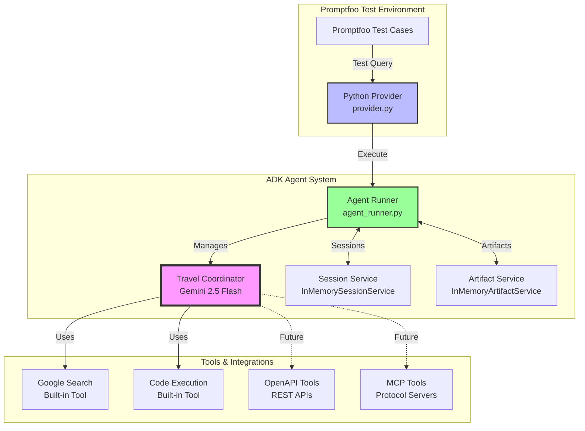

# Testing Google ADK Agents with Promptfoo

[Google's Agent Development Kit (ADK)](https://github.com/google/adk-python) is an open-source Python framework for building sophisticated AI agents, announced at Google Cloud NEXT 2025. The same framework powers production agents within Google products like Agentspace and the Google Customer Engagement Suite. ADK addresses the shift from single-purpose AI models to intelligent, autonomous multi-agent systems that can collaborate to solve complex problems.

This guide shows you how to:

- Build multi-agent systems with ADK using Gemini 2.5 Flash
- Leverage thinking capabilities for complex reasoning tasks
- Test agent behavior systematically using Promptfoo  
- Implement the Agent-to-Agent (A2A) protocol for standardized communication
- Use Promptfoo's tracing to debug agent interactions
- Integrate advanced tools including Google Search, OpenAPI, and MCP

## About Google ADK

ADK represents Google's answer to the growing need for structured agent development. While frameworks like LangChain provide chains and single agents, ADK is built from the ground up for **multi-agent orchestration** - enabling teams of specialized AI agents to work together on complex tasks.

**Key characteristics:**

- **Production-proven**: Powers agents in Google's own products
- **Multi-agent by design**: Built for hierarchical agent teams, not just single agents
- **Model-agnostic**: Works with 100+ models via Vertex AI Model Garden and LiteLLM
- **Thinking capabilities**: Leverages Gemini 2.5 Flash's reasoning mode for complex problems
- **Rich tool ecosystem**: Built-in tools, OpenAPI, MCP, and third-party integrations
- **Standardized communication**: A2A protocol enables interoperability between agents
- **Full lifecycle support**: Build, interact, evaluate, and deploy in one toolkit

**Framework comparison:**

| Feature               | Google ADK    | LangChain   | CrewAI      | Pydantic AI | OpenAI Agents |
| --------------------- | ------------- | ----------- | ----------- | ----------- | ------------- |
| Multi-agent focus     | ✅ Native      | ⚠️ Possible  | ✅ Core      | ❌ Single    | ✅ Native      |
| Thinking models       | ✅ Gemini 2.5  | ❌ External  | ❌ External  | ❌ External  | ✅ o1          |
| Built-in tools        | ✅ Many        | ✅ Many      | ⚠️ Some      | ❌ Few       | ⚠️ Some        |
| Standardized protocol | ✅ A2A         | ❌ Custom    | ❌ Custom    | ❌ N/A       | ✅ Swarm       |
| Model flexibility     | ✅ 100+ models | ✅ Many      | ⚠️ Some      | ✅ Many      | ❌ OpenAI only |
| Enterprise support    | ✅ Google      | ⚠️ Community | ❌ Community | ❌ Community | ✅ OpenAI      |
| Testing framework     | ✅ Promptfoo   | ⚠️ Basic     | ❌ Limited   | ⚠️ Basic     | ⚠️ Basic       |

_Source: Framework documentation and community comparisons (2025)_

## Example Use Cases

ADK's multi-agent architecture excels in complex domains that benefit from specialized expertise:

### Financial Trading Systems

Google's reference implementation showcases an [Agentic Trading Simulator](https://medium.com/google-cloud/architecting-a-multi-agent-system-with-google-a2a-and-adk-4ced4502c86a) with:

- **AlphaBot**: Trading strategy agent analyzing market data
- **RiskGuard**: Compliance agent enforcing position limits
- **Coordinator**: Orchestrating agent interactions via A2A protocol

This architecture demonstrates how separating concerns into specialized agents creates maintainable, auditable systems.

## Quick Start

Get started with a complete multi-agent travel planning system that demonstrates ADK's capabilities:

```bash
# Initialize the ADK agents example
npx promptfoo@latest init --example google-adk-agents

# Navigate to the example
cd google-adk-agents

# Install Python dependencies
pip install -r requirements.txt

# Set up your API key
export GOOGLE_API_KEY=your_api_key_here

# Run the evaluation
npx promptfoo@latest eval
```

## Architecture Overview

Our travel planning example demonstrates a clean, modular architecture:



This architecture shows how:
1. **Promptfoo** sends test queries through a simple Python provider
2. The **Agent Runner** handles ADK session management, artifacts, and execution
3. The **Travel Coordinator** uses Gemini 2.5 Flash with thinking capabilities
4. **Built-in tools** like Google Search provide real-time data
5. **Future extensions** for OpenAPI and MCP tools are ready to integrate

## Understanding ADK Architecture

ADK's architecture reflects lessons learned from building AI systems at Google scale. Here's how the core components work together:

### Agent Types and When to Use Them

#### 1. LLM Agents with Thinking Mode

The workhorses of ADK, now enhanced with Gemini 2.5 Flash's thinking capabilities:

```python
from google.adk.agents import Agent

travel_agent = Agent(
    name="travel_coordinator",
    model="gemini-2.5-flash-preview-05-20",
    instruction="You are an expert travel planner with deep reasoning capabilities",
    tools=[google_search, code_execution],
    config={
        "thinking_mode": "auto",  # Let model decide when to think
        "max_output_tokens": 65000,  # Leverage massive output capacity
        "temperature": 0.7
    }
)
```

**Use for**: Tasks requiring reasoning, complex optimization, natural language understanding, or creative problem-solving.

#### 2. Workflow Agents

Deterministic orchestrators that don't require LLM overhead:

```python
from google.adk.agents import SequentialAgent

booking_pipeline = SequentialAgent(
    name="booking_workflow",
    agents=[
        validate_request,    # Validate input
        search_options,      # Find available options
        rank_results,        # Sort by criteria
        format_response      # Structure output
    ]
)
```

**Use for**: Predictable processes, pipelines, or when you need guaranteed execution order.

## Leveraging Gemini 2.5 Flash Thinking Mode

Gemini 2.5 Flash introduces controllable thinking capabilities that dramatically improve complex task performance:

### Dynamic Thinking Allocation

```python
from google.adk.callbacks import CallbackRegistry

callbacks = CallbackRegistry()

@callbacks.before_model_callback
def enhance_with_thinking(llm_request, context):
    """Dynamically set thinking budget based on query complexity"""
    query = llm_request.contents[0].parts[0].text.lower()
    
    # Determine thinking budget
    if any(word in query for word in ['optimize', 'analyze', 'compare', 'multi-city']):
        thinking_budget = 8192  # High complexity
    elif any(word in query for word in ['recommend', 'suggest', 'find']):
        thinking_budget = 4096  # Medium complexity
    else:
        thinking_budget = 0  # Simple queries don't need thinking
    
    llm_request.config.thinking_config = {
        "thinking_budget": thinking_budget
    }
```

### Example: Simple vs Complex Queries

**Simple Query (No Thinking)**:
```
User: "What's the weather in Tokyo?"
Agent: [Instant response] "Tokyo currently has..."
```

**Complex Query (Deep Thinking)**:
```
User: "Plan a 14-day trip through Europe for $3000, optimizing the route 
       through Paris, Rome, Barcelona, and Amsterdam to minimize costs."
Agent: [Thinks through options] "After analyzing multiple route permutations 
       and considering transportation costs, here's the optimal itinerary..."
```

## Advanced Tool Integration

ADK supports a rich ecosystem of tools beyond basic function calls:

### Built-in Tools

```python
from google.adk.tools import google_search, code_execution

# Google Search for real-time data
agent = Agent(
    tools=[google_search],  # Automatically available
    instruction="Use google_search to find current flight prices"
)

# Code Execution for calculations
agent = Agent(
    tools=[code_execution],
    instruction="Use code_execution to calculate and compare budgets"
)
```

### OpenAPI Tools

Convert any REST API to an ADK tool:

```python
from google.adk.tools import OpenAPIToolset

# Create tools from OpenAPI spec
flight_tools = OpenAPIToolset(
    spec_path="https://api.airline.com/openapi.json",
    headers={"Authorization": "Bearer ${API_KEY}"}
)

agent.tools.extend(flight_tools.get_tools())
```

### MCP (Model Context Protocol) Tools

Connect to standardized tool servers:

```python
from google.adk.tools import McpToolset
from google.adk.tools.mcp import McpClient

# Connect to Google Maps MCP server
maps_client = McpClient("npx", ["@modelcontextprotocol/server-googlemaps"])
maps_tools = McpToolset(maps_client)

agent.tools.extend(maps_tools.get_tools())
```

## The A2A Protocol: Enabling Agent Collaboration

The [Agent-to-Agent (A2A) protocol](https://a2a-spec.org/) is ADK's standardized communication layer, similar to how HTTP enables web services to communicate. This JSON-RPC based protocol ensures agents can work together regardless of their implementation details.

### Core A2A Concepts

```python
# Agent publishes its capabilities via Agent Card
agent_card = {
    "name": "flight_agent",
    "description": "Searches and books flights",
    "endpoint": "https://api.example.com/agents/flight",
    "capabilities": ["flight_search", "booking", "cancellation"]
}

# Agents communicate using standardized messages
task_request = {
    "method": "tasks/send",
    "params": {
        "task": {
            "name": "search_flights",
            "input": {
                "origin": "NYC",
                "destination": "LAX",
                "date": "2024-12-15"
            }
        }
    }
}
```

## Building the Enhanced Travel Planning System

Let's walk through the complete example with advanced features:

### Travel Coordinator with Callbacks

```python
# agents/coordinator.py
from google.adk.agents import Agent
from google.adk.tools import google_search, code_execution
from google.adk.callbacks import CallbackRegistry

# Create callbacks for smart behavior
callbacks = CallbackRegistry()

@callbacks.after_model_callback
def cache_response(llm_response, context):
    """Cache responses for similar queries"""
    query = context.state.get('original_query', '')
    cache_key = f"cache:travel:{hash(query) % 10000}"
    
    context.state[cache_key] = {
        'response': llm_response.content,
        'timestamp': context.state.get('request_time')
    }
    
    return llm_response

# Create enhanced coordinator
travel_coordinator = Agent(
    name="travel_coordinator",
    model="gemini-2.5-flash-preview-05-20",
    description="AI travel expert with Gemini 2.5 reasoning",
    instruction="""You are an advanced travel planning AI.
    
    Use your thinking capabilities to:
    - Analyze complex multi-city routes
    - Optimize budgets with calculations
    - Search for real-time prices
    - Compare destinations thoroughly
    
    Tools:
    - google_search: For current prices and availability
    - code_execution: For budget calculations
    """,
    tools=[google_search, code_execution],
    callbacks=callbacks,
    config={
        "thinking_mode": "auto",
        "max_output_tokens": 65000
    }
)
```

### Production-Ready Runner

```python
# agent_runner.py (simplified)
from google import adk
from google.adk.sessions import InMemorySessionService
from google.adk.artifacts import InMemoryArtifactService

class EnhancedRunner:
    def __init__(self):
        self.session_service = InMemorySessionService()
        self.artifact_service = InMemoryArtifactService()
        self.performance_metrics = []
    
    async def execute_with_monitoring(self, prompt, session_id=None):
        """Execute agent with performance monitoring"""
        start_time = time.time()
        
        # Get or create session
        session = await self.get_or_create_session(session_id)
        
        # Run agent
        runner = adk.Runner(
            agent=travel_coordinator,
            session_service=self.session_service,
            artifact_service=self.artifact_service
        )
        
        # Execute and collect response
        response = await runner.run_async(prompt, session.id)
        
        # Record metrics
        self.performance_metrics.append({
            "duration": time.time() - start_time,
            "prompt_length": len(prompt),
            "response_length": len(response)
        })
        
        return response
```

### Comprehensive Test Configuration

```yaml
# promptfooconfig.yaml
description: 'Google ADK Travel System with Gemini 2.5 Flash'

providers:
  - id: file://provider.py
    label: ADK Travel System (Gemini 2.5)
    config:
      model: gemini-2.5-flash-preview-05-20
      thinking:
        enabled: true
        mode: auto
        maxBudget: 8192

tests:
  # Test thinking capabilities
  - description: 'Complex optimization requiring deep thinking'
    vars:
      query: |
        Plan a 14-day Europe trip for $3000. 
        Optimize route: Paris → Rome → Barcelona → Amsterdam.
        Minimize travel costs, maximize time in each city.
        Include specific flight options and calculate totals.
    assert:
      - type: llm-rubric
        value: |
          Response should show evidence of:
          1. Route optimization analysis
          2. Cost calculations
          3. Time optimization
          4. Specific recommendations
```

## Viewing Traces in Promptfoo

After running your evaluation with tracing enabled:

1. Run the evaluation:
   ```bash
   npx promptfoo@latest eval
   ```

2. Open the web UI:
   ```bash
   npx promptfoo@latest view
   ```

3. Click the magnifying glass (🔎) icon on any test result to see:
   - **Trace Timeline**: Visual representation of agent operations
   - **Span Hierarchy**: See how agents delegate to sub-agents
   - **Performance Metrics**: Identify bottlenecks in your agent pipeline
   - **Error Details**: Debug failures with full stack traces

The trace view shows exactly how your multi-agent system processes requests:

```
[Root: agent.call (1.2s)]
  ├─[agent.prepare_context (5ms)]
  ├─[llm.generate (400ms)]
  ├─[sub_agent.flight_search (350ms)]
  │  └─[tool.search_flights (200ms)]
  ├─[sub_agent.hotel_search (300ms)]
  │  └─[tool.search_hotels (150ms)]
  └─[sub_agent.activity_planning (150ms)]
```

## Best Practices for ADK with Promptfoo

### 1. Structure Your Agents Hierarchically

Keep your agent hierarchy shallow and logical:

```python
# Good: Clear hierarchy with focused roles
root_coordinator
├── domain_expert_1 (flights)
├── domain_expert_2 (hotels)
└── domain_expert_3 (activities)

# Avoid: Deep, complex hierarchies
root
└── manager_1
    └── manager_2
        └── worker_1
            └── sub_worker
```

### 2. Use Tracing to Optimize Performance

Add meaningful span attributes to identify bottlenecks:

```python
with tracer.start_span("agent.decision") as span:
    span.set_attribute("decision.type", "routing")
    span.set_attribute("options.count", len(available_agents))
    # Your routing logic
```

**Instrument Sub-Agents Too**: While the example's flight_agent.py shows how to add tracing to sub-agents, in the current implementation these traces won't appear due to ADK session limitations. However, in a full ADK deployment, instrumenting all agents provides complete observability:

```python
# In sub-agents like flight_agent.py
tracer = trace.get_tracer("adk.flight_agent")

def search_flights(...):
    with tracer.start_span("flight.search") as span:
        span.set_attribute("search.origin", origin)
        # Tool logic with tracing
```

### 3. Test Agent Interactions Thoroughly

Use Promptfoo's assertions to verify agent coordination:

```yaml
tests:
  - description: 'Verify agent delegation'
    vars:
      query: 'Book a flight and hotel in London'
    assert:
      # Check both agents were used
      - type: javascript
        value: |
          // Look for evidence of multi-agent coordination
          const response = output.response || output;
          const mentionsFlightAgent = response.includes('flight agent') || 
                                     response.includes('Flight Agent');
          const mentionsHotelAgent = response.includes('hotel agent') || 
                                    response.includes('Hotel Agent');
          return mentionsFlightAgent || mentionsHotelAgent;
```

### 4. Handle Failures Gracefully

Implement fallback behavior when sub-agents fail:

```python
travel_coordinator = LlmAgent(
    instruction="""If a sub-agent fails:
    1. Try an alternative approach
    2. Provide partial results with clear explanation
    3. Suggest manual alternatives
    Never leave the user without options."""
)
```

### 5. Common Agent Patterns

**Delegation Pattern**: Route requests to specialized agents based on content:
```python
instruction="""Analyze requests and delegate:
- Flight-related → flight_agent
- Accommodation → hotel_agent
- Activities → activity_agent
Combine responses into cohesive plans."""
```

**Sequential Processing**: Process information in logical order:
```python
instruction="""Process travel requests in this order:
1. Validate destination and dates
2. Search flights first (determines arrival/departure)
3. Find hotels near airports/attractions
4. Plan activities based on hotel location"""
```

**Information Aggregation**: Merge results from multiple agents:
```python
instruction="""After receiving sub-agent responses:
1. Check for conflicts (timing, location)
2. Optimize for user preferences
3. Present unified itinerary with costs
4. Highlight any compromises made"""
```

## Next Steps

1. **Explore the example**: The [google-adk-agents example](https://github.com/promptfoo/promptfoo/tree/main/examples/google-adk-agents) includes all the code shown here
2. **Extend the system**: Add new agents for car rentals, visa requirements, or travel insurance
3. **Set up monitoring**: Configure trace forwarding to your observability platform
4. **Advanced testing**: Use Promptfoo's red teaming features to test agent security

## Learn More

### ADK Resources

- [ADK GitHub Repository](https://github.com/google/adk-python) - Source code and examples
- [ADK Documentation](https://google.github.io/adk-docs/) - Comprehensive guide
- [Agent-to-Agent (A2A) Protocol Spec](https://a2a-spec.org/) - Communication standard

### Promptfoo Integration

- [Promptfoo ADK Example](https://github.com/promptfoo/promptfoo/tree/main/examples/google-adk-agents) - Complete working example
- [Tracing Documentation](/docs/tracing) - Full tracing guide
- [Python Provider Guide](/docs/providers/python) - Custom provider documentation

---

By combining Google ADK's powerful agent framework with Promptfoo's testing and tracing capabilities, you can build reliable multi-agent systems with full visibility into their behavior.
