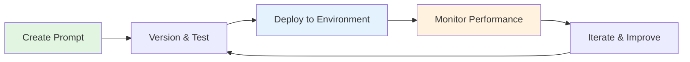

# Prompt Management

## 🎯 Overview

Promptfoo's Prompt Management system transforms how teams develop, test, and deploy AI prompts. By treating prompts as first-class citizens in your development workflow, you can ensure consistency, track performance, and collaborate effectively across your organization.


### Why Prompt Management?

:::info Key Benefits
- **🔄 Version Control**: Track every change with full history and rollback capabilities
- **🚀 Deployment Tracking**: Know exactly which prompts are running in production
- **🧪 A/B Testing**: Compare prompt versions side-by-side with comprehensive metrics
- **🤝 Team Collaboration**: Share, review, and improve prompts together
- **📊 Performance Analytics**: Monitor prompt effectiveness over time
- **🔒 Security**: Control access and audit prompt usage across your organization
:::

## 🚀 Quick Links

<div className="row">
  <div className="col col--4">
    <div className="card">
      <div className="card__header">
        <h3>🏃 Get Started</h3>
      </div>
      <div className="card__body">
        <p>New to prompt management? Start here!</p>
      </div>
      <div className="card__footer">
        <a href="quickstart" className="button button--primary button--block">Quickstart Guide →</a>
      </div>
    </div>
  </div>
  <div className="col col--4">
    <div className="card">
      <div className="card__header">
        <h3>📚 Learn Concepts</h3>
      </div>
      <div className="card__body">
        <p>Understand the core principles</p>
      </div>
      <div className="card__footer">
        <a href="concepts" className="button button--secondary button--block">Core Concepts →</a>
      </div>
    </div>
  </div>
  <div className="col col--4">
    <div className="card">
      <div className="card__header">
        <h3>🔧 API Reference</h3>
      </div>
      <div className="card__body">
        <p>Integrate with your applications</p>
      </div>
      <div className="card__footer">
        <a href="api-reference" className="button button--secondary button--block">View API →</a>
      </div>
    </div>
  </div>
</div>

## 🏗️ Architecture

The prompt management system consists of:

1. **Storage Layer**: SQLite (local) or cloud database
2. **Management API**: CRUD operations, versioning, deployment
3. **CLI Interface**: Command-line tools for prompt operations
4. **Web UI**: Visual interface for prompt management
5. **Integration Layer**: Seamless integration with evaluations

## 🌟 Key Features

### Core Capabilities

Every prompt change creates a new version with author tracking and timestamps. Compare versions, view diffs, and rollback when needed.


### 🚀 Environment Deployments

Deploy specific prompt versions to different environments (development, staging, production) with full tracking.


### 🤖 Auto-Tracking

Automatically discover and track prompts used in your evaluations, making it easy to organize existing prompts.

### 🔧 Full Feature Support

Managed prompts support all Promptfoo features:
- Configuration (temperature, max_tokens, etc.)
- Function prompts (JavaScript/Python)
- Chat formats
- Response schemas
- Transforms
- All file formats

### 🌐 Dual Mode Operation

Work locally with YAML files or use cloud storage for team collaboration.

### 🆕 Advanced Features

- **[Smart Variable Suggestions](management#smart-variable-suggestions)**: AI-powered test value generation
- **[Version Selector Dialog](management#re-running-evaluations-with-different-prompt-versions)**: Quickly test different prompt versions
- **[Auto-Tracking](auto-tracking)**: Automatically discover and track unmanaged prompts
- **[Function Support](configuration#function-prompts)**: Execute JavaScript/Python functions as prompts
- **[Configuration Merging](configuration#configuration-merging)**: Inherit and override prompt settings

## 📋 Use Cases

### 1. A/B Testing Prompts

Test multiple prompt versions simultaneously to find the best performer.

```yaml
prompts:
  - pf://welcome-message:v1
  - pf://welcome-message:v2
  - pf://welcome-message:experimental
```

### 2. Environment-Specific Prompts

Use different prompt versions for different environments.

```yaml
prompts:
  - pf://assistant:development  # Verbose logging
  - pf://assistant:staging      # Standard behavior  
  - pf://assistant:production   # Optimized for performance
```

### 3. Compliance and Auditing

Track who changed what, when, and why with full version history.


### 4. Team Collaboration

Multiple team members can work on prompts with conflict resolution and merge capabilities.

## 🔄 Workflow Overview



## 📊 Comparison: File-Based vs Managed Prompts

| Feature        | Local Mode  | Cloud Mode        |
| -------------- | ----------- | ----------------- |
| Storage        | YAML files  | Database          |
| Collaboration  | Git-based   | Real-time         |
| Access Control | File system | Role-based        |
| Backup         | Manual      | Automatic         |
| Performance    | Fast        | Network-dependent |
| Setup          | Zero config | Requires auth     |

## 🎓 Learning Path

1. **Start Here**: [Quickstart Guide](quickstart) - Get running in 5 minutes
2. **Understand**: [Core Concepts](concepts) - Learn the fundamentals
3. **Configure**: [Configuration Reference](configuration) - Set up your system
4. **Automate**: [Auto-Tracking Guide](auto-tracking) - Discover prompts automatically
5. **Integrate**: [API Reference](api-reference) - Build programmatic access
6. **Master**: [Best Practices](best-practices) - Production-ready patterns

## 🔗 Related Resources

- **[Technical Overview](management)** - Deep dive into features
- **[CLI Documentation](../usage/command-line)** - Command reference
- **[Enterprise Features](../enterprise)** - Team collaboration tools
- **[Red Team Integration](../red-team)** - Security testing workflows

## 🆘 Need Help?

<div className="alert alert--info">
  <strong>💬 Join our community:</strong>
  <ul>
    <li><a href="https://discord.gg/promptfoo">Discord</a> - Get help from the community</li>
    <li><a href="https://github.com/promptfoo/promptfoo/issues">GitHub Issues</a> - Report bugs or request features</li>
    <li><a href="mailto:support@promptfoo.dev">Email Support</a> - Enterprise support</li>
  </ul>
</div> 