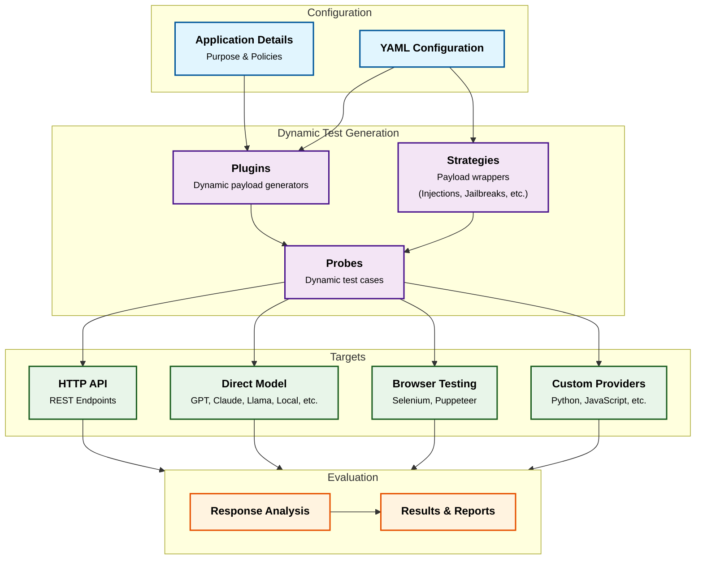
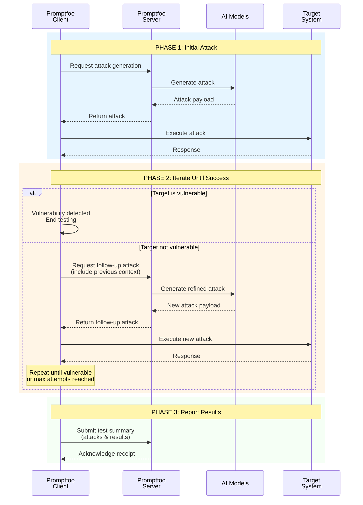

# Architecture

Promptfoo automated red teaming consists of three main components: **plugins**, **strategies**, and **targets**.

Each component is designed to be modular and reusable. We're building a framework that is useful out of the box with minimal configuration, but can be extended with custom components.

For usage details, see the [quickstart guide](/docs/red-team/quickstart).

## Core Components

### Test Generation Engine

The test generation engine combines plugins and strategies to create attack probes:

- **[Plugins](/docs/red-team/plugins)** generate adversarial inputs for specific vulnerability types. Each plugin is a self-contained module that can be enabled or disabled through configuration.

  Examples include [PII exposure](/docs/red-team/plugins/pii/), [BOLA](/docs/red-team/plugins/bola/), and [Hate Speech](/docs/red-team/plugins/harmful/).

- **[Strategies](/docs/red-team/strategies/)** are patterns for delivering the generated adversarial inputs.

  The most fundamental strategy is `basic`, which controls whether original test cases are included in the output. When disabled, only modified test cases from other strategies are included.

  Other strategies range from simple encodings like [base64](/docs/red-team/strategies/base64/) or [leetspeak](/docs/red-team/strategies/leetspeak/) to more complex implementations like [Microsoft's multi-turn attacks](/docs/red-team/strategies/multi-turn/) and [Meta's GOAT framework](/docs/red-team/strategies/goat/).

- **Attack Probes** are the natural language prompts generated by combining plugins and strategies.

  They contain the actual test inputs along with metadata about the intended vulnerability test. Promptfoo sends these to your target system.

### Target Interface

The target interface defines how test probes interact with the system under test. We support [over 30 target types](/docs/providers/), including:

- **[HTTP API](/docs/providers/http/)** - Tests REST endpoints via configurable requests
- **[Direct Model](/docs/red-team/configuration/#custom-providerstargets)** - Interfaces with LLM providers like OpenAI or local models
- **[Browser](/docs/providers/browser/)** - Runs end-to-end tests using Selenium or Puppeteer
- **[Custom Provider](/docs/red-team/configuration/#providers)** - Implements custom runtime integrations via Python/JavaScript

Each target type implements a common interface for sending probes and receiving responses.

### Evaluation Engine

The evaluation engine processes target responses through:

- **[Vulnerability Analysis](/docs/red-team/llm-vulnerability-types)** - Scans responses for security issues using configurable detectors
- **Response Analysis** - Examines output content and behavior patterns using [LLM-as-a-judge grading](/docs/configuration/expected-outputs/)
- **Results** - Generates findings with:
  - Vulnerability type
  - Severity
  - Attack vector
  - Mitigation steps

### Configuration

Configuration ties the components together via `promptfooconfig.yaml`. See [configuration guide](/docs/red-team/configuration) for details.

The configuration defines:

- Target endpoints and authentication
- [Enabled plugins](/docs/red-team/configuration/#plugins) and their settings
- [Active strategies](/docs/red-team/configuration/#strategies)
- Application context and [policies](/docs/red-team/configuration/#custom-policies)

## Component Flow

1. **Configuration** initializes **plugins** and **strategies**
2. **Test engine** generates probes using enabled components
3. **Target interface** delivers probes to the system
4. **Evaluation engine** analyzes responses and reports findings

Components can be used independently or composed into larger test suites. The modular design allows for extending functionality by adding new [plugins](/docs/red-team/configuration/#plugins), [strategies](/docs/red-team/configuration/#strategies), [targets](/docs/providers/) or evaluators.

For CI/CD integration, see our [automation guide](/docs/integrations/ci-cd).

## Data Flow

The following sequence diagram illustrates the runtime communication between Promptfoo components during a red team assessment.

The data flow follows a three-phase approach:

**Phase 1: Initial Attack Generation**: The Promptfoo Client requests an attack from the cloud service, which leverages AI models to generate adversarial payloads. These attacks are based on the configured plugins and strategies.

**Phase 2: Iterative Refinement** - The client executes attacks against the target system and evaluates responses. If a vulnerability is detected, testing concludes. Otherwise, the client generates follow-up attacks, providing context from previous attempts.

This feedback loop generates increasingly sophisticated attacks, applying different strategies and attack vectors until either a vulnerability is found or the maximum attempt limit is reached.

**Phase 3: Results Reporting**: Upon completion, the client produces a comprehensive test summary.

