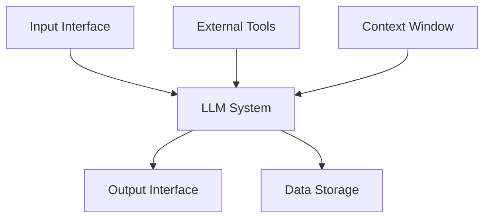

# Promptfoo Terminology

This page defines key terms and concepts used throughout Promptfoo's documentation and tooling.

:::tip Quick Reference

- **Prompt**: Template with variables for LLM input
- **Provider**: LLM service or endpoint being tested
- **Test Case**: Combination of inputs and expected outputs
- **Plugin**: Module that generates adversarial tests
- **Strategy**: Technique for delivering test inputs
  :::

## Core Concepts

### Prompt Template

A reusable prompt structure with variable placeholders (e.g., `{{var}}`). Forms the basis for systematic LLM testing by allowing consistent input variation.

```yaml
# Example prompt template
prompts:
  - 'Translate this text to {{language}}: {{input}}'
```

### Provider

An LLM service or endpoint that processes prompts and returns responses. Can be:

| Type              | Examples                   | Common Use Cases          |
| ----------------- | -------------------------- | ------------------------- |
| Cloud API         | OpenAI, Anthropic, Mistral | Production testing        |
| Local Model       | Llama, GPT4All             | Privacy-sensitive testing |
| Custom Endpoint   | REST API, WebSocket        | Testing deployed services |
| Browser Interface | Selenium, Puppeteer        | End-to-end testing        |

### Test Vector

A specific combination of prompt, variables, and expected behavior designed to test a particular aspect of an LLM system.

```yaml
# Example test vector
tests:
  - vars:
      language: French
      input: Hello world
    assert:
      - type: contains
        value: Bonjour
```

### Coverage Analysis

Measurement of how thoroughly a test suite exercises an LLM system's capabilities and potential vulnerabilities:

- Input variations
- Edge cases
- Response scenarios
- Security boundaries

### Chain Testing

Evaluation of multi-step LLM processes where outputs from one step become inputs for another. Critical for:

- RAG systems
- Autonomous agents
- Complex workflows

## Testing Framework

### Components

#### Assertions

Requirements that automatically validate LLM outputs:

```yaml
assert:
  - type: contains-json # Verify JSON structure
  - type: similar # Check semantic similarity
  - type: javascript # Custom validation logic
  - type: llm-rubric # AI-based grading
```

#### Variables

Placeholders in prompts that are substituted during testing:

- Simple substitution: `{{variable}}`
- Nested objects: `{{user.name}}`
- Array access: `{{items[0]}}`

#### Transform Functions

Code that modifies inputs or outputs during testing:

<details>
<summary>Example Transform Function</summary>

```javascript
function transform(vars, context) {
  return {
    ...vars,
    uppercase_input: vars.input.toUpperCase(),
    timestamp: new Date().toISOString(),
  };
}
```

</details>

### Evaluation

#### Matrix View

Interactive comparison of test results across:

- Multiple prompts
- Different models
- Test scenarios
- Assertion results

#### Baseline Model

A reference LLM implementation used to:

- Compare outputs
- Establish expected behavior
- Grade other models' responses

#### Output Formats

Ways to view and analyze results:

| Format      | Use Case             | Features               |
| ----------- | -------------------- | ---------------------- |
| CLI Table   | Quick review         | Compact, filterable    |
| HTML Report | Detailed analysis    | Interactive, shareable |
| JSON/YAML   | Integration          | Machine-readable       |
| Web UI      | Collaborative review | Real-time updates      |

## Red Team Testing

### Methodology

#### Testing Flow

1. **Configuration**: Setup prompts and targets
2. **Generation**: Create adversarial tests
3. **Evaluation**: Run tests against targets
4. **Analysis**: Review vulnerability report
5. **Mitigation**: Address identified issues

#### Attack Surface

Areas of potential vulnerability:



### Tools & Components

#### Plugins

Modular testing components that generate adversarial inputs:

<details>
<summary>Plugin Categories</summary>

| Category  | Examples                     | Purpose                 |
| --------- | ---------------------------- | ----------------------- |
| Security  | BOLA, SSRF                   | Access control testing  |
| Privacy   | PII, Data leaks              | Information protection  |
| Safety    | Harmful content, Hate speech | Content moderation      |
| Technical | SQL injection, Jailbreaking  | Infrastructure security |

</details>

#### Strategies

Techniques for delivering adversarial inputs:

```yaml
redteam:
  strategies:
    - basic # Direct testing
    - jailbreak # Safety bypass attempts
    - prompt-injection # System prompt manipulation
    - multilingual # Language-based attacks
```

### Vulnerability Types

#### Model-Layer

Issues inherent to foundation models:

- Prompt injections
- Jailbreaks
- Harmful outputs
- Hallucinations

#### Application-Layer

Issues from system integration:

- Indirect prompt injections
- Tool/API misuse
- Data exfiltration
- Access control bypasses

## Technical Reference

### Configuration Components

#### Provider Configuration

```yaml
providers:
  - openai:gpt-4
  - anthropic:claude-3-opus
  - custom:
      api: http://localhost:8000
      headers:
        Authorization: Bearer ${API_KEY}
```

#### Test Suite Organization

Methods for structuring tests:

- YAML configuration
- CSV datasets
- Google Sheets
- Programmatic generation

### Integration

#### External Files

Supported file types and uses:

- `.txt`: Prompt templates
- `.js`/`.py`: Transform functions
- `.json`: Chat conversations
- `.csv`: Test cases
- `.pdf`: Context documents

#### CI/CD Integration

```yaml
# Example GitHub Actions workflow
steps:
  - uses: actions/checkout@v2
  - name: Run Promptfoo Tests
    run: |
      npx promptfoo eval
      npx promptfoo redteam run
```

## Related Resources

- [Getting Started](/docs/getting-started)
- [Configuration Guide](/docs/configuration/guide)
- [Red Team Documentation](/docs/red-team/)
- [Provider Documentation](/docs/providers/)
