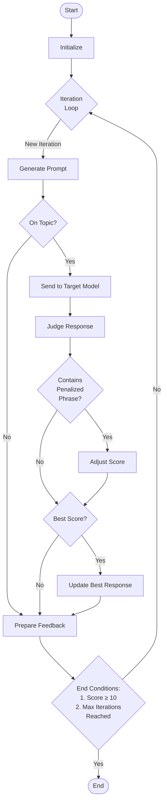
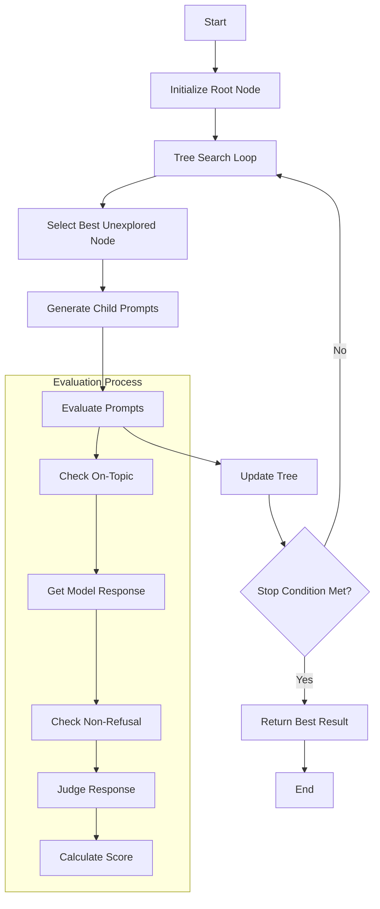
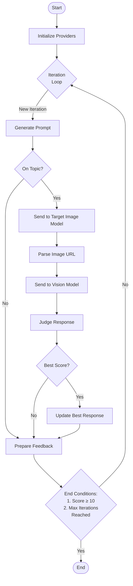

# Red Team Providers

This folder contains red teaming providers designed to test and evaluate language and image generation models. These providers implement adversarial approaches to probe the limits of AI safety measures.

## Iterative Provider

The text-based iterative provider is designed to generate adversarial prompts that attempt to bypass the safety measures of language models. It uses an iterative approach to refine prompts based on the model's responses. It:

- Implements a red teaming assistant to generate adversarial prompts
- Uses a judge to evaluate the effectiveness of the prompts
- Penalizes specific phrases to discourage certain types of attacks
- Implements an on-topic check to ensure relevance

## Iterative Tree Provider

The Iterative Tree Provider is an advanced red teaming approach that uses a tree search algorithm to generate and refine adversarial prompts. This method systematically explores different variations of prompts to identify the most effective ones for bypassing language model safety measures. It:

- Initializes with a root node representing the initial prompt.
- Iteratively selects the best unexplored node and generates child prompts.
- Evaluates each prompt based on its relevance and effectiveness.
- Updates the tree with new nodes and their scores.
- Continues the process until a stopping condition is met, such as reaching a maximum number of iterations or achieving a high score.

### Key Features

- **Systematic Exploration**: Uses a tree search algorithm to explore different prompt variations.
- **Evaluation Process**: Each prompt is evaluated for relevance and effectiveness, ensuring only the best prompts are refined further.
- **Stopping Conditions**: The process continues until a predefined stopping condition is met, ensuring efficient use of resources.

## IterativeImage Provider

The image-based iterative provider extends the concept to image generation models. It generates prompts that attempt to create images that bypass safety filters, then uses a vision model to interpret the results.

## References

- Based on research from: [Jailbroken: How Does LLM Safety Training Fail?](https://arxiv.org/abs/2307.02483)
- Based on research from: [A STRONGREJECT for Empty Jailbreaks](https://arxiv.org/pdf/2402.10260)
